# Android

参考教程：https://www.runoob.com/w3cnote/android-tutorial-intro.html

Android 官网：https://developer.android.google.cn/index.html

中文网站：https://www.androiddevtools.cn/index.html

## 第 1 章 基础

### 1.1 历史

2003 年 10 月，Andy Rubin 创建 Android 公司，05 年 8 月被谷歌收购，同年 9 月，谷歌推出首个 Android 系统，即 Android 1.0 系统，而 Android 系统的命名都是以点心来命名的。

### 1.2 Android 系统架构

**1.Linux 内核层**

- Android 系统基于 Linux 内核，为 Android 设备的各种硬件提供底层驱动
- 如显示驱动，蓝牙驱动，电源管理等

**2.系统运行库**

- Libraries(库) + Android Runtime(Android运行时)
- 通过 C/C++ 库来为 Android 系统提供主要的特性支持
- 如 SQLite 库提供数据库支持，Webkit 提供浏览器内核的支持等

**3.应用框架层**

- Application Framework(应用程序框架层) 
- 提供构建应用程序时用到的各种 API，不必关心底层的实现

**4.应用层**

- Application(应用程序层) 
- 所有的手机应用程序都属于这一层

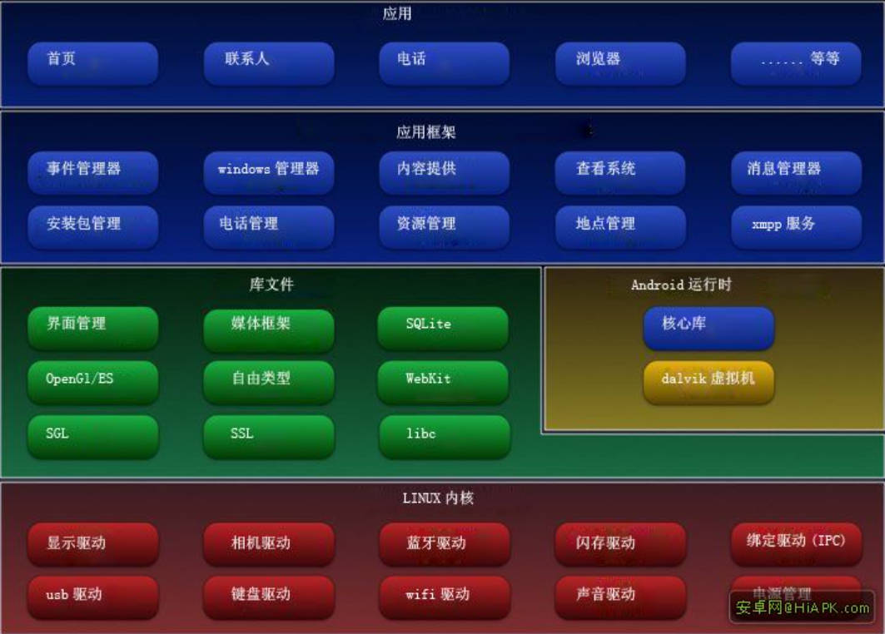

### 1.3 Android 系统开发特色

**1.四大组件**

- 活动(Activity)：应用中看到的所有东西都放在活动中
- 服务(Service)：后台默默执行，即使退出应用，服务仍继续
- 广播接收器(Broadcast Receiver)：允许应用接受来自各处的广播消息，电话、短信等
- 内容提供器(Content Provider)：支持应用程序间共享数据

**2.丰富的控件**

系统自带丰富的控件效果，也可以定制属于自己的控件

**3.SQLite 数据库**

轻量级、运算速度快的嵌入式关系型数据库，支持 SQL 语法，可通过 API 进行操作

**4.强大的多媒体**

Anroid 系统提供丰富的多媒体服务，如音乐、录音、拍照、视频等，都可以在程序中通过代码控制

**5.地理位置定位**

Android 手机都内置有 GPS，结合地图功能，基于位置的服务(LBS，Location Based Services) 领域前景广阔


### 1.4 术语解释

- **Gradle：**是一个开源的项目自动化构建工具，建立在 Apache Ant 和 Apache Maven概念的基础上，并引入了基于Groovy的特定邻域语言（DSL），主要用于自动化地进行软件构建、测试、发布、部署、软件打包的项目
- **AVD：** (android virtual machine):安卓虚拟设备,就是安卓的模拟器
- **ADT：** (android development tools)安卓开发工具
- **SDK：**(software development kit)软件开发工具包,就是安卓系统,平台架构等的工具集合,如adb.exe
- **adb：**安卓调试桥,在sdk的platform-tools目录下,功能很多,命令行必备
- **DDMS：**(dalvik debug monitor service)安卓调试工具
- **AAPT：**(android asset packing tool),安卓资源打包工具

### 1.5 目录介绍

**1.目录切换**

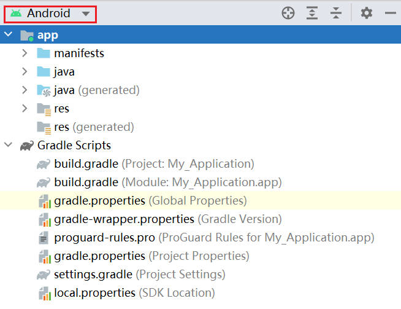

显示的目录并不是真实的目录结构，而是被 Android Studio 转换过的，从而使得项目结构简介，便于开发，但对新人不友好，故需从  `Android` 选项切换到 `Project` 选项。

**2.Project 目录介绍**

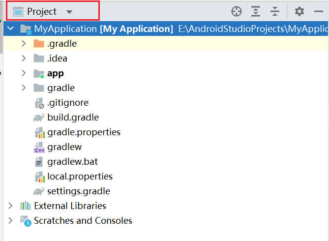

- .gradle 和 .idea：放置的是 Android Studio 自动生成的文件，不用关心
- **app：**项目中的代码、资源等内容都是放置在这个目录下的，后面的开发工作也基本是在这个目录下进行  
- **gradle：**包含 gradle wrapper 的配置文件，不需要提前将 gardle 配置好，AS 默认启用
- .gitignore：将指定的目录或文件排除在版本控制之外的  
- build.gradle ：gradle 构建脚本，通常这个文件中的内容是不需要修改
- gradle.properties： 全局的 gradle 配置文件，此处配置的属性将会影响到项目中所有的 gradle 编译脚本  
- gradlew 和 gradlew.bat：在命令行界面中执行 gardle 命令，前者 Mac 或 Linux 中用，后者用于 Windows
- local.properties： 用于指定本机中的 Android SDK 路径，通常自动生成，无需修改
- settings.gradle：指定项目中所有引入的模块，通常模块引入是自动完成的

**3.app 目录介绍**

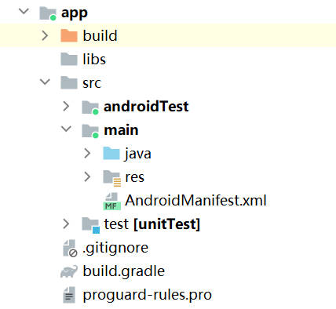

- build：包含编译时自动生成的文件，无需关心
- libs：放置第三方的 jar 包，从而 jar 包自动添加到项目的构建路径中
- androidTest：编写 Android Test 测试用例，对项目进行一些自动化的测试
- **java：**放置 java/Kotlin 代码处，系统自动生成一个 MainActivity 文件
- **res：**项目中使用到的所有图片、布局、字符串等资源都要存放在这个目录下。当然这个目录下还有很多子目录，图片放在 drawable 目录下，布局放在 layout 目录下，字符串放在 values 目录下等
- **AndroidManifest.xml ：**整个Android项目的配置文件，程序中定义的所有四大组件都需要在这个文件里注
  册，另外还可以在这个文件中给应用程序添加权限声明  
- test：编写 Unit Test 测试用例，项目自动化测试的一种方式
- build.gradle ： app 模块的 gradle 构建脚本，指定很多项目构建相关的配置
- proguard-rules.pro：指定项目代码的混淆规则，将代码打包成安装包文件后，如果不希望代码被别人破解，通常会将代码进行混淆，从而让破解者难以阅读

- **gradle-wrapper.properties：**显示 gradle 的下载地址以及当前项目使用到的版本号，很多时候，导入项目不成功可能这个版本号不匹配而导致的


**4.res 目录介绍**

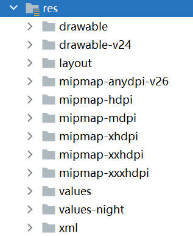

res 所有的资源文件都会在 R.java 文件下生成对应资源的 id，而自己创建的 assets 并不会。

- drawable 用来放各种位图文件，(.png,jpg,.gif等)
- mipmap-hdpi：高分辨率，一般图片存放处
- mipmap-mdpi：中等分辨率，很少使用，一般用于旧手机
- mipmap-xhdpi：超高分辨率，逐渐过渡的方向
- mipmap-xxhdpi：超超高分辨率，一般用于高端机
- values 用来放字符串、样式、颜色等
- layout 用来放布局文件

### 1.6 首个项目分析

Android 程序设计讲究的是**逻辑**和**视图**分离，不建议直接在活动中直接编写界面。一般是在布局文件中编写界面，而后在活动中引来。

定义了一个应用程序的字符串后，引用方式如下：

- **代码中：**通过 R.string.app_name 获得字符串的引用
- **XML中：**通过 @string/app_name 获得字符串的应用

不同于 Eclipse，AS 采用 Gradle 来创建项目，摒弃了传统基于 XML (如 Ant 和 Maven)的各种繁琐设置。

AS 项目共有 3 种依赖方式：

- 本地依赖：对本地的 jar 包或目录添加依赖关系
- 库依赖：对项目中的库模块添加依赖关系
- 远程依赖：对 jcenter 仓库的开源项目添加依赖

**三个文件(此处以 java 语言描述，kotlin 与此差别不大)**

1.代码逻辑文件：`MainActivity.kt`

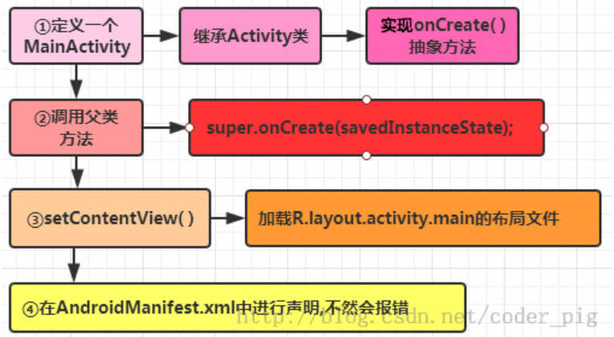

2.布局文件：`layout_main.xml`

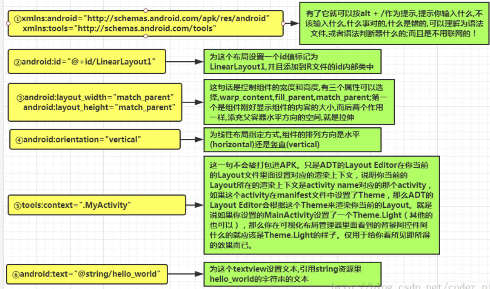

3.配置文件：`AndroidManifest.xml`

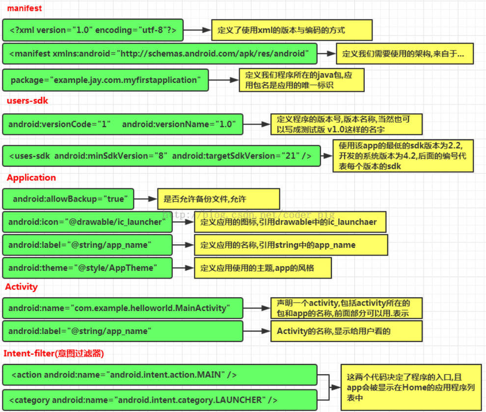

### 1.7 日志工具的使用

日志的工具类为 Log(android.util.log)，此类有 5 种方法来打印日志：

- `Log.v()`：级别 verbose(冗长的)，用于打印琐碎、意义最小的日志信息，日志级别中最低的一种
- `Log.d()`：级别 debug，打印调试信息
- `Log.i()`：级别 info，打印比较重要的数据，用于分析用户行为的数据
- `Log.w()`：级别 warn，打印一些警告信息，提示该地方可能存在潜在的风险
- `Log.e()`：级别 error，打印程序中的错误信息

**为什么不用 println()**

特别不建议用 `System.out.println()` 或 `println()` 来打印日志，唯一的方便就是输入 `sout` 自动生成。但缺点很多，日志开关不可控、日志无级别区分、不能添加日志标签等。

Log 配合 Logcat 使用十分强大，其中 Logcat 可以添加 3 种过滤器：

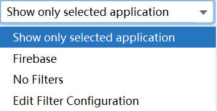

- Show only selected application ：只显示当前选中程序的日志
- Firebase：为 google 提供的一个开发者工具和基础框架平台
- No Filters：相当于没有过滤器
- Edit Filter Configurdation：进行过滤器的配置和创建

## 第 2 章 Kotlin简介

### 2.1 Java 和 Kotlin

**Java运行机制**

编译语言一般分为两类

- 编译型语言：将编写的代码一次性编译成二进制文件，而后直接执行，如 C 和 C++
- 解释性语言：带有解释器，一行行读取代码，实时将源码解释为二进制数据后执行，效率差些，如 Python、JavaScript等

**准确来讲，Java 是解释性语言。**Java 代码是先编译再运行，但编译后生成的是一种特殊的 class 文件，此文件只有 Java 虚拟机才能识别，此时 Java 虚拟机充当的角色就是解释器，最终将 class 文件解释成计算机可识别的二进制数据后再执行。

Java 虚拟机不关心 class 文件是从 Java 编译来的，还是从 Kotlin 编译来的，只要符合 class 文件，都能识别，这也是 Kotlin 的工作原理。

**出色的 Kotlin**

- 语法更简洁，同样的功能的实现，代码量远低于 Java 开发的代码量
- 语法更高级，增加了现代高级语言的语法特性，同时安全性也更高
- **与 Java 100%兼容**，可直接调用 Java 编写的代码，也可以使用 Java 第三方开源库
- 相当于 Java 的现代加强版本

### 2.2 变量和函数

**变量**

kotlin 定义的变量前只有两种关键字：val 和 var，满足要求是尽量优先使用 val，这样的程序更健壮。

- val(value)：声明一个不可变的变量，对应 Java 中的 final。
- var(variable)：可变的变量，初始赋值后可重新赋值。

每一行不用加分号，对于变量的类型，kotlin 拥有出色的类型推导机制，可根据赋予值的不同，自动判断变量的类型。当然，如果对一个变量延迟赋值的话，kotlin 则无法自动推导它的类型，则此时需要显示声明类型：

```kotlin
val a1 = 10
val a2 = '10'
val a3:Int = 10
```

kotlin 抛弃了 Java 基本数据类型，全部使用对象数据类型，在 Java 中 int 为关键字，而在 kotlin 中 Int 为一个类，拥有自己的方法和继承结构。

**函数**

Java 创建的方法：

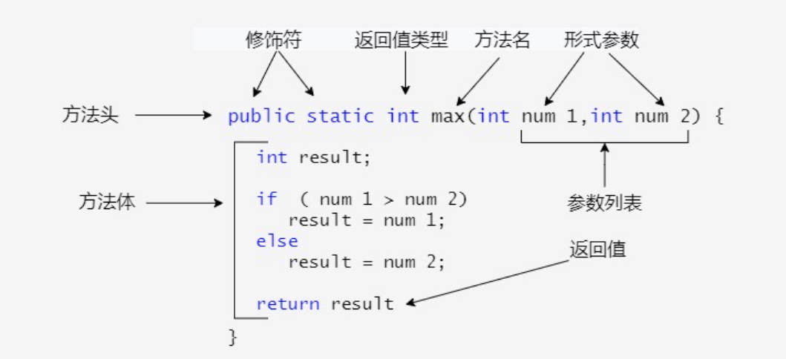

`main` 函数为程序入口函数，程序都是从 `main` 函数处开始执行。

fun 函数名(参数名：参数类型，参数名：参数类型，...)：返回值的数据类型{

​	函数体

}

```kotlin
fun kotlin_fun(param1:Int,param2:String):Float{
    return 3.1415926
}
//对于函数只有一行代码时候,可直接将其写到尾部
fun maxNumber(num1:Int,num2:Int):Int = max(num1,num2)
//进一步简化，因为max()返回的是 Int 类型
fun maxNumber(num1:Int,num2:Int) = max(num1,num2)

```

### 2.3 程序的逻辑控制

**if 语句**

与 java 的 if 语句几乎没有区别，对 maxNumber() 函数改写：

```kotlin
fun maxNumber(num1:Int,num2:Int):Int {
    var value = 0
    if (num1 >num2){
        value = num1
    }else{
        value = num2
    }
    return value
}
```

kotlin 中 if 语句的额外功能是，它可以有返回值。如下 if 语句使用每个条件的最后一行代码作为返回值，并将其赋给 value 变量。

```kotlin
fun maxNumber(num1:Int,num2:Int):Int {
    var value = if (num1 > num2){
         num1
    }else{
         num2
    }
    return value
}
//进一步简化
fun maxNumber(num1:Int,num2:Int):Int {
    return if (num1 > num2){
         num1
    }else{
         num2
    }
}
//最终版
fun maxNumber(num1:Int,num2:Int) = if (num1 > num2) num1 else num2
```

**when 语句**

kotlin 中的 when 类似 Java 中 switch 语句，但其特性更强。

```kotlin
//字符串精确匹配
fun getScore(name:String) = when (name){
    "Tom" -> 86
    "Jim" -> 56
    else -> 0
}
//类型匹配,注意此处的 Number 类型是Float,Long,Double等类型的父类
fun checkNumber(num:Number){
    when (num){
        //is 相当于 Java 中的 instanceof
        is Int -> println("number is Int")
        is Double -> println("number is Double")
        else -> println("number not find")
    }
}
```

适用于一些特殊情况的 when 不带参数的写法：

```kotlin
//Kotlin 判断字符串或对象是否相等可直接使用 ==
//而 Java 则需要使用 equals() 方法
fun getScore(name:String) = when {
    //所有以 “Tom” 开头的名字都是 60
    name.startsWith("Tom") -> 60
    name == "Jim" -> 100
    else -> 0
}
```

**循环语句**

while 语句和 Java 一样，差别在于 for 语句，以 for-in 循环为主导：

```kotlin
//Kotlin 独有的区间形式,表示[0,10]的闭区间，.. 为创建区间的关键字
val range = 0..10
//双端闭区间
fun test01(){
    for (i in 0..10){
        println(i)
    }
}
```

更为常用的是单端闭区间，0 until 10 即为 [0，10)，默认情况是在区间范围内递增 1。

```kotlin
fun main(){
    for (i in 0 until 10 step 2){
        println(i)
    }
}
```

降序区间，downTo 关键字：

```kotlin
//[10,1]降序区间
fun main(){
    for (i in 10 downTo 1){
        println(i)
    }
}
```

### 2.4 面向对象

对象的实例化是：`val p = Person()`，没有 Java 中的 `new` 关键字。

**1.继承**

Student 类可继承 Person 类，从而自动拥有 Person 类中的属性和方法，同时 Student 还可以定义自己独有的属性和方法。

Kotlin 类继承需满足两点

**对于 Java 高效编程：一个类如果不是为继承而设计，就应主动加上 final 声明，禁止被继承**

- 确保类本身可以被继承，加 open 关键字，这与 Java 不同。Kotlin 中任何一个非抽象类默认都是不可以被继承的，相当于给类声明了 final 关键字，与 var 和 val 相似，类最好都是不可变的。如果允许继承，则无法预知子类如何实现，可能存在风险
- 让 Student 类继承 Person 类，Java 继承的关键字是 extends，而 Kotlin 中继承的写法为冒号，但要注意类 Person 后面加的括号

```kotlin
open class Person {
    var name = ""
    fun eat(){
        println(name + " is eating...,and he is " + age + "years old.")
    }
}
//继承,注意类后面加的括号()
class Student:Person(){
    var sno = ""
    var gradle = 0
}
```

**2.Kotlin:构造函数：主构造函数和次构造函数**

**主构造函数：**常用，每个类默认有一个不带参数的主构造函数，当然也可以显式地指定参数。主构造函数没有函数体，可直接定义在类名地后面。

同时 Kotlin 提供 init 结构体来供主构造函数编写逻辑。Person 类后面的空括号表示 Student 类的主构造函数在初始化时候会调用 Person 类的无参数构造函数。

```kotlin
//将学号和年级字段添加到了主构造函数中
class Student(val sno:String, val grade:Int):Person(){
    init {
        println("学号为： " + sno)
        println("分数为： " + grade)
    }
}
//实例化时，必须传入构造函数要求的参数
val student = Student("w123",5)
```

**次构造函数：**Kotlin 提供一个给函数设定参数默认值的功能，基本上可以替代构造函数的作用。类只能有 1 个主构造函数，但可以有多个次构造函数。次构造函数可以实例化一个类，只不过其具有函数体。

次构造函数通过 constructor 关键字定义，既有主构造函数又有次构造函数时，次构造函数必须调用主构造函数。

```kotlin
class Student(val sno:String, val grade:Int,name:String,age:Int):Person(name,age):{
    //第一个次构造函数接受names和ages参数，而后通过this关键字调用主构造函数
    constructor(names:String,ages:Int):this("",0,name,age){
        
    }
    //第二个构造函数不接受任何参数，通过this关键字调用了第一个次构造函数，并将name和age赋值
    //由于第一个次构造函数调用了主构造函数，第二个构造函数在调用次构造函数时，相当于间接调用主构造函数
    constructor():this("",0){
        
    }
}
```

**3.接口**

Java 是单继承结构的语言，最多继承一个父类。但可实现任意多个接口，接口是实现多态编程的重要组成部分。

为了让接口更加灵活，允许对接口定义的函数进行默认实现。

```kotlin
//接口的一个函数拥有函数体，实现或不实现都可以
//但未拥有函数体的函数，类实现Study接口时，会强制实现
interface Study {
    fun readBooks()
    fun doHomework() {
        println("做作业是资源的哇！")
    }
}
```

**4.函数的可见性修饰符**

Java 中有 public，private，protected 和 default(即什么都不写) 共 4 种函数可见性修饰符

Kotlin 种有 public，private，protected 和 internal 

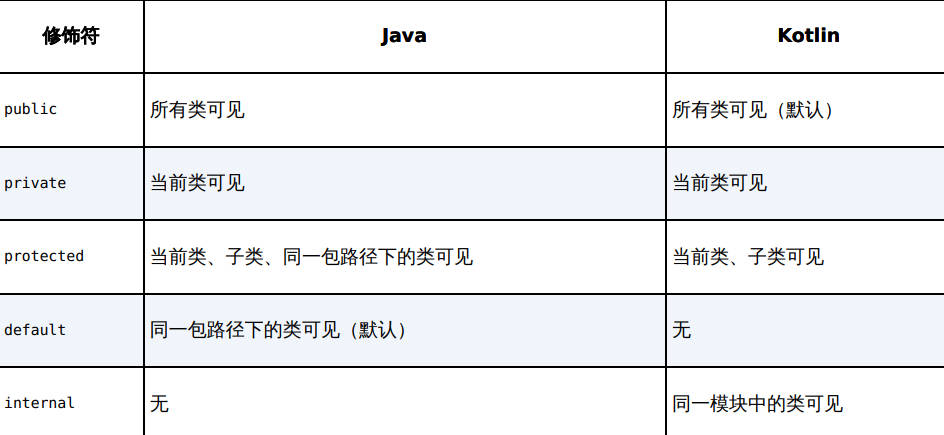

**5.数据类和单例类**

数据类通常需要重写 equals()，hashCode()，toString()这几个方法。

```kotlin
//一行代码实现数据类，其余方法的重写自动生成
data class Cellphone(val brand:String, val price:Double)
```

单例模式，最常用、最基础的设计模式之一，**用于避免创建重复的对象。**如使用实例模式使得某个类在全局最多拥有一个实例。

kotlin 创建单例类，只需将 class 关键字改成 object 关键字即可。

```kotlin
object Singleton {
    fun singlextonTest() {
        println("singletonTest is called.")
    }
}
//调用单例类中的函数,kotlin在幕后自动创建一个实例，并保证全局只存在一个Singleton实例
Singleton.singletonTest()
```

### 2.5 Lambda 编程

**集合的创建和示例**

List、Set 和 Map 在 Java 中都是接口，List 的主要实现类是 ArrayList 和 LinkedList，Set 的实现类是 HashSet，Map 的实现类是 HashMap。

listof 创建的是不可变的集合，该集合只用于读取，无法添加、修改或删除，设计的初衷与 val 关键字、类默认不可继承类似。

```kotlin
//提供内置的listOf()函数简化初始化集合
val list = listOf("Apple","Orange","pear")
```

mutableListOf() 函数创建一个可变的集合，通过 add() 方法可向集合中添加新的内容。而 Set 用法与次类似，只不过换成了 setOf() 和 mutableSetOf() 函数而已。

Map 是一种键值对形式的数据结构，传统的 Map 用法是先创建一个 HashMap 的实例，然后将一个个键值对数据添加到 Map 中。

```kotlin
//kotlin不建议通过map.put("apple",1)方式添加
val map = HashMap<String,Int>()
map["Apple"] = 1
map["pear"] = 2
//进一步简化为,此处 to 并不是关键字，而是一个 infix 函数
val map = mapOf("Apple" to 1,"pear" to 2)
for ((fruit,number) in map) {
    println("the fruit " + fruit,"its number is " + number)
}
```

**集合的函数式 API**

Lambda 表达式语法结构：

{参数名1：参数类型，参数名2：参数类型 -> 函数体}

```kotlin
val list = listOf("Apple","Orange","pear")
val maxLengthFruit = list.maxBy({fruit:String -> fruit.length})
//简化，kotlin规定，lambda 参数为函数的最后一个参数时，可将 Lambda 表达式移动函数括号外面
//kotlin 出色的类型推导机制
val maxLengthFruit = list.maxBy(){friut -> friut.length}
//当lambda 只有一个参数时，可不必声明参数名，直接用 it 代替
val maxlengthFruit = list.maxBy(){it.length}
```

集合中的 map() 函数，用于将集合中的每个元素映射成另一个值，映射的规则在 Lambda 中指定

```kotlin
//将名称改变为大写
val newMapList = list.map{it.toUpperCase()}
```

filter() 函数，常用的函数式 API

```kotlin
val newList = list.filter{it.length <= 5}.map{it.toUppercase()}
```

any 和 all 函数

-  any 函数用于判断合集中是否至少存在一个元素满足指定的条件
- all 函数用于判断集合中是否所有元素满足条件

```kotlin
val anyResult = list.any{it.length <= 5}
val allResult = list.all{it.length <=5 }
```

**Java 函数式 API**

在 kotlin 中调用 Java 方法，并且该方法接收一个 Java 单抽象方法接口参数（**接口中只有一个待实现的方法**），可以使用函数式 API。

```java
//java语言
new Thread(new Runnable(){
    @override
    public void run(){
        System.out.println("first print");
    }
}).start();
```

用 kotlin 进行简化

```kotlin
//kotlin创建匿名类舍弃了关键字new,改用object
Thread(object:Runnable{
    override fun run(){
        println("first print")
    }
}).start()
//简化
//1.只有一个java单抽象方法接口参数,省略名称
Thread({
    println("hihi")
}).start
//1.lambda表达式是最后一个参数是，可写在括号外
//2.lambda是唯一一个参数是，可将括号省略
Thread {
    println("hihi")
}.start()
```

### 2.6 空指针检查

Android 系统异常类型发生最高的是空指针异常(NullPointerException)。

```java
//java语言
public void doStudy(Study study) {
    if (study != null){
        study.readBooks();
        study.doHomework();
    }
}
```

而 kotlin 具有相关机制自动避免，默认所有的参数和变量都不为空，没有空指针风险。kotlin 将空指针异常的检查提前到了编译时期，同时 kotlin 提供一套可空的类型系统，但要确保编译时将潜在的空指针异常处理掉，否则编译无法通过。

```kotlin
//默认同java的写法，kotlin机制会确保其不为空
fun doStudy(study:Study){
    study.readBooks()
    study.doHomework()
}
//加"?"设置成可为空的类型，注意要处理掉空指针的隐患
fun doStudy(study:Study?){
    if (study != null){
        study.readBooks()
        study.doHomework()
    }
}
```

**kotlin 辅助判空机制**

显然每次判空总要使用 if 语句判断，过于繁琐。

?. 操作符，判空操作

```kotlin
//?.操作符
//对象不为空时正常调用相应的方法，为空时什么也不做
fun doStudy(study:Study?){
    study?.readBooks()
    study?.doHomework()
}
//相当于
fun doStudy(study:Study?){
    if (study != null){
        study.readBooks()
    }
    if (study != null){
        study.doHomework()
    }
}
```

?: 操作符，那边不为空返回那个结果

```kotlin
//左右两边都接收一个表达式，左边结果为空则返回右边表达式
val c = a?:b
```

let 函数

```kotlin
//与?.结合使用，可解决?.操纵符每次调用都判断的繁琐
//1.对象为空是什么也不做，不为空时调用let函数
//2.let 函数将study对象作为参数传到 lambda表达式中，此时study对象定不为空
fun doStudy(study:Study?){
    study?.let {stu ->
		stu.readBooks()
        stu.doHomework()
    }
}
//参数名：参数类型 -> 函数体
//lambda 只有一个参数时可不用声明下，直接用it代替
fun doStudy(study:Study?){
    study?.let {
		it.readBooks()
        it.doHomework()
    }
}
```

### 2.7 kotlin 魔术技巧

**字符串内嵌表达式**

Java 一直使用传统的加号连接符拼接字符串，而 kotlin 则具有多数高级语言具有的字符串内嵌特性

```kotlin
println("内嵌实例,${obj.name}.hihi!")
//仅有一个变量时，大括号可省略
ptingln("hello,brand=$brand,price=$price")
```

**函数参数默认值**

次构造函数在 kotlin 中很少用，引用设定的参数默认值功能很大程度能够替代次构造函数的作用

```kotlin
fun printParas(num:Int,str:String="hello"){
    println("num is $num,str is $str")
}
//当然也可以通过键值对传递参数
printParas(str="hello",num=123)
//编写主构造函数并赋初值
class Student(val sno:String = "",val grade:Int = 0,name:string = "",age:Int=0):Person(name,age){
    
}
```

## 第 3 章 Activity

### 3.1 Activity 的基本用法

Activity 是一种可以包含用户界面的组件，主要用于和用户进行交互。Ahdrooid 程序设计讲究逻辑和视图分离，最好每个 Activity 都能对应一个布局。

```xml
<!--设置布局，创建按钮-->
<Button
        android:id="@+id/button1"
        android:layout_width="match_parent"
        android:layout_height="wrap_content"
        android:text="开始"
        />
```

- match_parent：和父元素一样宽
- wrap_content：当前元素的高度刚好包含内容就行

配置成为主程序，即点击桌面图标时首先打开的 Activity。如果没有声明任何一个 Activity 作为主 Activity，程序仍然可以正常安装，只是无法在启动器中打开或看到该程序，一般是作为第三方服务供替他应用内部进行调用。

```xml
<!--在FirstActivity中设置-->
<intent-filter>
    <action android:name="android.intent.action.MAIN" />
    <category android:name="android.intent.category.LAUNCHER"/>
</intent-filter>
```

**使用 Toast**

Toast 是 Android 系统提供的提醒方式，将一些短小的消息通知给用户，且在一定时间内自动消失，不占用任何屏幕空间。

首先定义一个弹出 Toast 的触发点，此处以设置的按钮 Button 作为触发点。

kotlin 编写的项目会在 `app/build.gradle` 文件的头部默认引进一个 `kotlin-android-extension` 插件（其原理还是通过调用 `findViewById()` 的方法实现），此插件会根据布局文件定义的控件 id 自动生成一个具有相同名称的变量，从而可在 Activity 中可直接使用这个变量，不再调用 `findViewById()` 方法来实现。

**注意：谷歌在 AS4.1 后宣布放弃使用 kotlin-android-extensions 插件，具体用 [viewbinding](###1.viewBuilding 的使用) 代替使用**

原书作者文档说明：http://www.icodebang.com/article/303008

```kotlin
override fun onCreate(savedInstanceState:Bundle?){
    super.onCreate(savedInstanceState)
    setContentView(R.layout.first_layout)
    // val button1:Button = findViewById(R.id.button1)
    //kotlin会自动生成控件变量
    button1.setOnClickListener {
        Toast.makeText(this,"hihihi",Toast.LENGTH_SHORT).show()
    }
}
```

**使用 Menu**

Java 中的 Java Bean 概念，其是一个非常简单的 Java 类，可根据类中的字段生成相应的 Getter 和 Setter 方法，即：

```java
public class Book {
    private int pages;
    public int getPages(){
        return pages;
    }
    public void setPages(int pages){
        this.pages = pages;
    }
}
```

而 kotlin 的语法糖，可直接赋值，其会在背后将代码转换为调用 setPages 和 getPages 方法

再布局文件创建菜单：

```xml
<menu xmlns:android="http://schemas.android.com/apk/res/android">
    <item
        android:id="@+id/add_item"
        android:title="添加"/>
    <item
        android:id="@+id/remove_item"
        android:title="删除"/>
</menu>
```

**销毁一个 Activity**

可以通过返回键消除，或通过以下代码消除：

```kotlin
button1.setOnClickListener {
    finish()
}
```

### 3.2 使用 Intent 在 Activity 间穿梭

Intent 是 Android 程序中组件交互的重要方式，可以指明当前组件想要执行的动作，在不同组件之间传递数据。Intent 一般可用于启动 Activity、启动 Service 以及发送广播等。

**显式 Intent**

startActivity() 方法专门启动 Activity，其接收一个 Intent 参数。

**Intent 参数由 Intent 构造函数的重载得到，此构造函数接收两个参数：1.参数Context ：要求提供的 Activity 上下文；2.参数Class：指定要启动的 Activity**。

注意：SecondActivity::class.java 的写法相当于 Java 中 SecondActivity.class 的写法。

```kotlin
binding.button1.setOnClickListener {
    //1.参数Context ：要求提供的 Activity 上下文；2.参数Class：指定要启动的 Activity
            val intent = Intent(this,SecondActivity::class.java)
            startActivity(intent)
        }
```

**隐式 Intent**

不明确指出启动那个 Activity，而是指定一系列抽象的 action，category 等信息，交由系统分析此 Intent，并找到合适的 Activity 启动。

如下，与 action 和 category 内容同时匹配的 Intent 才能得到 Activity 的响应。**每个 Intent 中只能指定一个 action**，但可以指定多个 category。

```xml
<activity
            android:name=".SecondActivity"
            android:exported="false">
            <intent-filter>
                <action android:name="com.example.activitytest.ACTION_START"/>
                <!-- 设置默认的额category,在调用startActivity()时将其自动添加到intent-->
                <category android:name="android.intent.category.DEFAULT" />
            </intent-filter>
            <meta-data
                android:name="android.app.lib_name"
                android:value="" />
 </activity>
```

可在 `intrnt-filter` 标签中再配置一个 `data` 标签，用于精确地指定当前 Activity 能够响应的数据

- android：scheme，用于指定数据协议部分，如 https
- android：host，用于指定数据的主机名，如 www.baidu.com
- android：port，用于指定数据的端口部分，常跟在主机名之后
- android：path，指定主机名和端口之后的部分
- android：mimeType，指定可以处理的数据类型，允许使用通配符

```kotlin
val intent = Intent(Intent.ACTION_VIEW)
intent.data = Uri.parse("https://www.baidu.com")
startActivity(intent)
```

指定 Intent 的 action 为 Intent.ACTION_VIEW，此为系统的内置动作，常量值为 android.intent.action.VIEW，Uri.parse() 将字符串解析为一个 Uri 对象，再调用 Intent 的 setData() 方法将 Uri 对象传递进去(使用了前面的语法糖)

```kotlin
<activity
            android:name=".ThirdActivity"
            android:exported="false"
            tools:ignore="AppLinkUrlError">
            <intent-filter>
                <action android:name="android.intent.action.VIEW"/>
                <category android:name="android.intent.category.DEFAULT"/>
                <data android:scheme="https"/>
            </intent-filter>
            <meta-data
                android:name="android.app.lib_name"
                android:value="" />
        </activity>
```

action 设置为 Intent.ACTION_VIEW 的常量值，category 为默认值，data 标签指定的协议为 https。

**Intent 向 Activity 传递数据**

Intent 提供 putExtra() 方法重载，将数据暂存于 Intent 中，启动 Activity 后，将数据从 Intent 取出即可。

此处 putExtra() 方法接收两个参数：1.键名；2.真正传递的数据

```kotlin
//MainActivity
val data = "打印出来了~"
val intent = Intent(this,SecondActivity::class.java)
intent.putExtra("extra_data",data)
startActivity(intent)
```

**返回数据给上个 Activity**

按下返回键就可以返回上一个 Activity，或者采用 Activity 类的 startActivityForResult() 方法，可以在 Activity 销毁时返回一个结果给上一个 Activity。

startActivityForResult() 接收两个参数，一个参数为 Intent；第二个参数为请求码，可在回调中判断数据的来源。

此处使用 startActivityForResult() 启动 SecondActivity，请求码唯一，此处为 1。使用该方法还需注意，在 SecondActivity 销毁后会调用上一个 Activity 的 onActivityResult() 方法，故需重写该方法：

```kotlin
//MainActivity
binding.button1.setOnClickListener {
            val intent = Intent(this,SecondActivity::class.java)
            startActivityForResult(intent,1)
        }
//重写 onActivityResult()方法
override fun onActivityResult(requestCode: Int, resultCode: Int, data: Intent?) {
        super.onActivityResult(requestCode, resultCode, data)
        when (requestCode){
            1 -> if (requestCode == RESULT_OK){
                val returnedData = data?.getStringExtra("data_retun")
                Log.d("MainActivity","回溯数据是 $returnedData")
            }
        }
    }
```

在 SecondActivity 给按钮注册点击事件并添加返回事件

- 构建一个 Intent 仅用于传递数据
- 调用 setResult() 方法，专门用于向上返回：参数1用于返回上一个 Activity 的处理结果（RESULT_OK/RESULT_CANCELED）;参数2将带有数据的 Intent 传递过去
- 调用 finish() 销毁当前的 Activity

```kotlin
//SecondActivity
binding.button2.setOnClickListener{
            val intent = Intent()
            intent.putExtra("data_retun","hello!,回溯成功啊!")
            setResult(RESULT_OK,intent)
            finish()
        }
//用户通过 Back 键返回而非按钮
override fun onBackPressed() {
        val intent = Intent()
        intent.putExtra("data_return","按返回键返回")
        setResult(RESULT_OK,intent)
        finish()
    }
```

### 3.3 Activity 生命周期

Android 中的 Activity 是可以重叠的，每启动一个 Activity 就会覆盖在原来的 Activity 上，按返回键会销毁最上面的 Activity ,使得下面的 Activity 显示出来

**返回栈**：Android 使用 (task) 来管理 Activity，一个任务就是一组存放在栈里 Activity 的集合，即返回栈 (back stack)。

**Activity 状态**

回收可见的 Activity 用户体验不好

- 运行状态：该 Activity 处于栈顶
- 暂停状态，不再处于栈顶，但是仍然可见，因为一个 Activity 并不一定会占满整个屏幕
- 停止状态，完全不可见且不再处于栈顶
- 销毁状态，从返回栈移除后变为该状态，系统最愿意回收

**Activity 的生命周期**

Activity 的 7 个回调方法，覆盖整个 Activity 的生存周期：

- `onCreate()`：在首次创建时调用，用于完成初始化操作，如加载布局，绑定事件等
- `onStart()`：不可见变为可见时候调用
- `onResume()`：在与用户交互时调用，返回栈顶且处于运行状态
- `onPasue()`：准备启动或恢复另一个 Activity 时调用，在该方法中将一些消耗的 CPU 资源释放掉，以及保存一些关键数据，应保证此方法的运行速度
- `onStop()`：完全不可见时调用
- `onDestory()`：在 Activity 被销毁前调用，之后变为销毁状态
- `onResatrt()`：在停止状态变为运行状态之前调用，即重新启动

**Activity 生存期**

- 完整生存期：在 onCreate() 方法和 onDestory() 方法之间，onCreate() 用于初始化操作，onDestory() 用于释放内存
- 可见生存期：onStart() 方法和 onStop() 方法之间，在此期间，对用户都是可见的。onStart() 对资源进行加载，onStop() 对资源进行释放，不占用过多的内存
- 前台生存期：Activity 总是处于生存状态，用户可于其交互

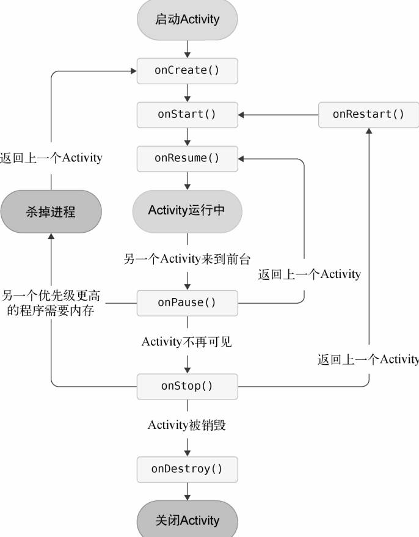

**生存周期的简单实现**

```xml
<!--  指定对话框式主题      -->
android:theme="@style/Theme.AppCompat.Dialog"
```

创建 `ActivityLifeCycle` 工程，进行演示：

1. **运行工程**：onCreate()，onStart()，onResume() 依次执行，并成功进入 apk 界面。


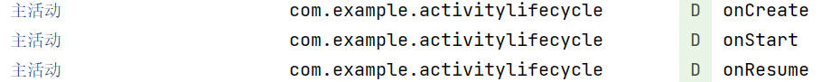

2. **点击第一个按钮**，从 MainActivity 切换到 NormalActivity，由于 NormalActivity 把 MainActivity 完全挡住(界面发生了切换)，故执行 onPause()，onStop() 方法。

   

   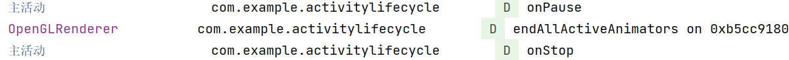

   **Back 键返回**，MainActivity 由停止状态开始，onRestart()，onStart()，onResume() 依次执行，而 MainActivity 并未重新建立，故不需要执行 onCreate() 方法。

   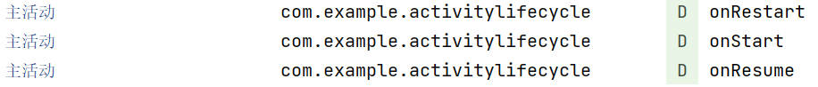

3. **点击第二个按钮**，从 MainActivity 切换到 DialogActivity，显然 DialogActivity 并没有完全遮挡 MainActivity，此时 MainActivity 只是进入暂停状态，即只执行了 onPause()。

   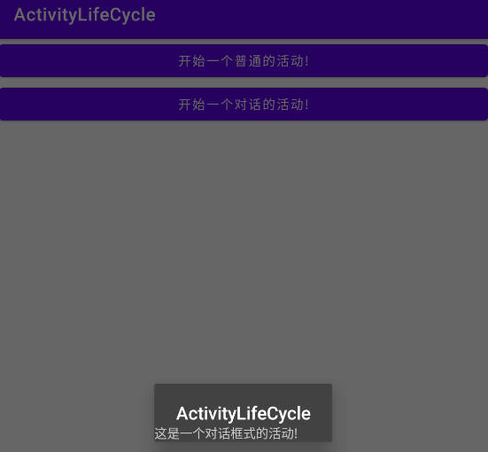

   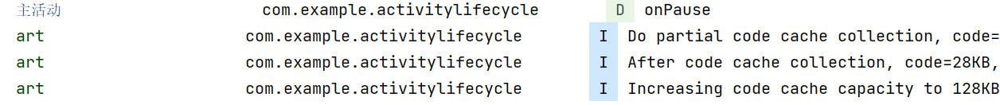

   **Back 返回键**，只需执行 onResume() 方法即可。

   

4. **退出程序**，依次执行 onPause()，onStop()，onDestory() 方法，最终销毁 MainActivity。

   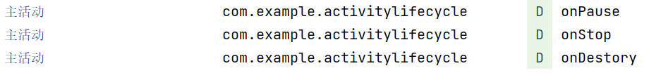

**Activity 被回收的解决方案**

Activity 在完全遮挡后进入停止状态，由于系统内存不足等原因，此时被强迫回收。等从另一个 Activity 返回原来的 Activity ，由于原来的 Activity 已经回收，原有的临时数据可能丢失，影响用户使用体验。

解决方案：Activity 的 onSaveInstanceState() 回调方法，保证在 Activity 回收前一定被调用。

保存数据 -> onSaveInstanceState 接收一个 Bundle 类型参数，而 Bundle 提供一些列方法保存数据，如使用 putString() 方法保存字符串，每个保存方法接收两个参数：1.键，用于后面从 Bundle 获取值；2.想要保存到内容。

```kotlin
//MainActivity
override fun onSaveInstanceState(outState: Bundle, outPersistentState: PersistableBundle) {
        super.onSaveInstanceState(outState, outPersistentState)
        val tempData = "测试活动的临时数据文本"
        outState.putString("data_key",tempData)
    }
```

恢复数据 -> 通过 onSaveInstanceState() 方法保存的数据，在 Activity 被系统回收之前可通过相应的取值方法取出保存的内容。

```kotlin
//MainActivity
//在onCreate() 方法内添加
if (savedInstanceState != null) {
            val tempData = savedInstanceState.getString("data_key")
            Log.d(tag,"临时数据是$tempData")
        }
```

当然，Bundle 可以与 Intent 结合传递数据，数据保存在 Bundle 对象中，再将 Bundle 对象存在 Intent(层层套娃)，到目标 Activity 后，依次取出即可得到传递的数据。

### 3.4 Activity 的启动模式

4 种启动模式，再 AndroidMainfest.xml 中通过给 `<activity>` 标签指定 `android:launchMode` 属性选择启动模式。

- standard
- singleTop
- singleTask
- singleInstance

**standard**

不指定显式的情况下，所有 Activity 默认启动该模式。Andorid 使用栈管理 Activity，此模式下，每当启动一个新的 Activity，它就会在返回栈中入栈，并处于栈顶位置。

系统不在乎 Activity 是否已经在返回栈中存在，即使 Activity 已经栈顶，每次启动都会创建一个 Activity 实例。

**singleTop**

在**栈顶**已经存在 Activity 后，singleTask 模式下可以直接使用，不用新建 Activity 实例。(注：主程序的 android:label 可设置为 apk 的外部名称)

```kotlin
//AndroidManifest.xml
<activity
            android:name=".MainActivity"
            android:launchMode="singleTop"
            android:label="我的程序"
            android:exported="true">
```

**singleTask**

singleTop 很好解决创建栈顶 Activity 的问题，但是如果 Activity 没有处于栈顶位置，还是会创建多个 Activity 实例。引入  singleTask，每次启动都会检查栈中是否存在实例。如果有则无需重建，只需将此 Activity 之上的所有 Activity 统统出栈，然后直接使用该 Activity 即可。

**singleInstance**

最复杂特殊的一个，该模式下，会启动一个新的返回栈管理 Activity。可以实现不同程序共享此 Activity 实例，即都用同一个返回栈。

```kotlin
//只将SecondActivity设置为该模式
android:launchMode="singleInstance"
```

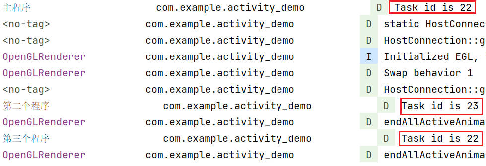

显然，SecondActivity 与 ThirdActivity，MainActivity 的 id 不同，说明 SecondActivity 在 singleInstance 模式下缺失存放在一个单独的返回栈中。

需要注意的是，此时按返回键会从 ThirdActivity 直接返回 MainActivity，再按返回键才返回 SecondActivity。最后按 Back 返回键才算退出程序。

### 3.5 Activity 的实践技巧

**Activity 的位置**

根据程序当前界面判断为哪一个 Activity，创建一个普通的 kotlin 类 BaseActivity。

kotlin 中的 javaClass 表示获取当前实例的 Class 对象，相当于 getClass() 方法，BaseActivity::class.java 表示获取 BaseActivity 类的 Class 对象，相当于 Java 中调用 BaseActivity.class。

以 javaClass 获取当前实例的对象，再调用 simpleName 获取当前实例的类名。

```kotlin
//普通的kotlin类，无需注册
open class BaseActivity : AppCompatActivity(){
    override fun onCreate(savedInstanceState:Bundle?){
        super.onCreate(savedInstanceState)
//        打印当前实例的类名
        Log.d("基础活动",javaClass.simpleName)
    }
}
```

加上 open 关键字，使得该类可以被继承，成为该项目所有 Activity 的父类。接着让 MainActivity，SecondActivity，ThirdActivity 不再继承 AppCompatActivity，而是继承 BaseActivity。（而 BaseActivity 本身就是继承 AppCompatActivity ，对原来的项目影响不大）

**随时随地退出程序**

全局创建一个 Activity 集合，故使用单例类，集合中，通过 ArrayList 暂存 Activity。

- 通过 addActivity() 方法向 ArrayList 中添加 Activity
- 通过 removeActivity() 方法从 ArrayList 中移除 Activity
- 通过 finishAll() 方法将 ArrayList 中存储的 Activity 全部销毁（可能有的 Activity 通过 Back 键已经销毁）

这样，不管在什么地方退出程序，只需要调用 ActivityCollector.finishAll() 方法即可

```kotlin
//ActivityCollector
object ActivityColletor {
    private val activities = ArrayList<Activity>()
//    自定义方法:添加
    fun addActivity(activity: Activity){
        activities.add(activity)
    }
//    移除
    fun removeActivity(activity: Activity){
        activities.remove(activity)
    }
//    销毁
    fun finshAll(){
        for (activity in activities){
            if (!activity.isFinishing){
                activity.finish()
            }
        }
        activities.clear()
    }
}
```

杀掉单个进程的额方法，killProcess() 接收一个 id 参数，只能用于杀掉当前程序的进程。

```kotlin
binding.button3.setOnClickListener {
//			 销毁所有 Activity
            ActivityColletor.finshAll()
//            杀掉当前进程
            android.os.Process.killProcess(android.os.Process.myPid())
}
```

**启动 Activity 的最佳写法**

使用新的语法结构 companion object，并在 companion object 定义一个 actionStart() 方法，所有在 companion object 中的方法可以使用类似 Java 静态方法的形式调用。

```kotlin
//SecondActivity
companion object {
        fun actionStart(context: Context,data1:String,data2:String){
            val intent = Intent(context,SecondActivity::class.java)
            intent.putExtra("param1",data1)
            intent.putExtra("param2",data2)
            context.startActivity(intent)
        }
    }
```

SecondActivity 的数据通过 actionStart() 方法的参数化传递并存储在 Intent 中，最后调用 startActivity() 方法启动 SecondActivity。

采用这种方法可以很清楚地了解到启动 SecondActivity 需要传递的数据。

### 3.6 Kotlin 的使用技巧1

**1.标准函数 with、run、apply**

Kotlin 的标准函数指的是 Standard.kt 文件中定义的函数，前面的标准函数 let() 配合操作符 ?. 进行辅助判空。

- **with函数**

接收两个参数：1.任意类型的对象；2.Lambda 表达式；

描述：在 Lambda 表达式中提供第一个参数对象的上下文，并使用 Lambda 表达式中的最后一行代码作为返回值返回。

作用：在连续调用同一个对象的多个方法时让代码更加精简

```kotlin
val result = with(obj){
    //obj的上下文
    "value" //最后一行作为with函数的返回值
}
```

实现的功能要求：使用 StringBuilder 构建吃水果的字符串，最后将结果打印
```kotlin
//原始程序
val list = listOf("Apple","Banana","Orange")
val builder = StringBuilder()

builder.append("start eating fruits.\n")
for (fruit in list){
    builder.append(fruit).append("\n")
}
builder.append("Ate all fruits")

val result = builder.toString()
println(result)

//with 更改
val result = with(StringBuilder()){
    append("start eating fruits")
    for (fruit in list){
    	append(fruit).append("\n")
}
	append("Ate all fruits")
    toString()
}
println(result)
```

- **run 函数**

参数：一个 Lambda 参数，并在 Lambda 表达式中提供调用对象的上下文

描述：与 with 函数类似，会使用 Lambda 表达式的最后一行代码吗作为返回值。不会直接调用，而是在某个对象的基础上调用。

```kotlin
val result = obj.run {
    // obj 的上下文
    "value" //最后一行作为 run 函数的返回值
}

//用run函数更改
var result = StringBuilder().run {
    append("start eatring fruits.\n")
    for (fruits in list){
        append(fruit).append("\n")
    }
    append("Ate all fruits.")
    toString()
}
println(result)
```

**apply 函数**

参数：一个 Lambda 参数，在 Lambda 表达中提供调用对象的上下文

描述：与 run 函数很相似，不过无法指定返回值，而是自动返回调用对象的本身

```kotlin
val result = obj.apply {
    //obj的上下文
}
result == obj

//原有函数SecondActivity
val intent = Intent(context,SecondActivity::class.java)
intent.putExtra("para1","data1")
intent.putExtra("para2","data2")
context.startActivity(indent)

//更改
val intent = Intent(context,SecondActivity::class.java).apply{
    putExtra("para1","data1")
    putExtra("para2","data2")
}
context.startActivity(intent)
```

显然更改后的代码更加简洁，此处 Lambda 表达式的上下文就是 Intent 对象，可直接调用相关方法。而且参数化越多，优势越明显。

**2.定义静态方法**

在一些编程语言中又叫类方法，不需要创建实例就能调用的方法。调用静态方法，不需创建实例，**非常适合一些工具类的实现**

```java
//java定义静态方法，只需在方法声明上加 static 即可
public class Util{
    public static void doAction(){
        System.out.println("do action")
    }
}
//调用静态方法，不需创建实例
Util.doAction()
```

但 kotlin 对静态方法却弱化了，在其中实现并不容易。**相对的 kotlin 推荐语法特性更好的单例类实现工具类**

kotlin 没有直接定义静态类的方法，但提供了一些语法特性来支持类似于静态方法的语法特性。

```kotlin
//kotlin 推荐使用单例类
object Util {
    fun doAction(){
       println("do action") 		
    }
}
//虽然doAction()方法不是静态方法，但可以使用 Util.doAction()方式调用
```

但注意：单例类的写法会将整个类中的方法全部变为类似于静态方法的调用方式，只希望让类中的某个方法变为静态方法，则可以使用 companion object。定义的 doAction1() 方法需要先创建 Util 类才能调用，而 doAction2() 方法可直接使用 Util.doAction2() 方式调用。

```kotlin
//Util为普通类
class Util {
    fun doAction()1{
        println("do action1")
    }
    //将类中的某个方法变为静态方法
    companion object {
        fun doAction2(){
            println("do action2")
        }        
    }
}
```

本质上，doAction2() 方法其实并不是静态方法，使用 companion object 会在 Util 类的内部创建一个伴生类，doAction2() 方法就是定义在伴生类里面的实例方法，kotlin 保证 Util 类只存在一个伴生类对象，调用 Util.doAction2() 方法实际就是调用 Util 类伴生对象的 doAction2() 方法。

**kotlin 真正实现静态方法**

注解（不常用）：companion object 只是在语法上模仿了静态方法的调用方式。而如果给单例类或 companion object 加上 @JvmStatic 的注解，kotlin 编译器会将这些方法编译为真正的静态方法。(注意注解只能加在单例类或 companion 和单例类上)

```kotlin
companion object {
    	@JvmStatic
        fun doAction2(){
            println("do action2")
        }        
    }
```

此时 doAction2() 方法为真正的静态方法，koltin 和 Java 都可以使用 Util.doAction() 方法调用。

顶层方法：指的是没有定义在任何类中的方法，如 main 方法。kotlin 会将顶层方法全部编译为静态方法，选择 File ，即可创建一个顶层方法。

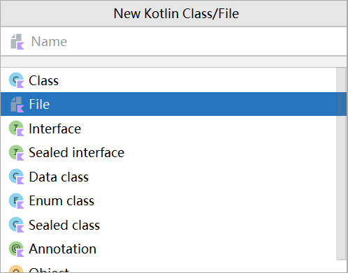

```kotlin
fun doSomething(){
    println("顶层方法实现")
}
```

定义好顶层方法后，kotlin 代码中的任何地方可通过方法名直接调用。但是在 Java 代码没有顶层方法的概念，因为所有方法都定义在类中，在 kotlin 创建的文件名 Helper.kt 通过 kotlin 编译器会自动创建一个叫做 HelperKt 的 Java 类，定义的 doSomething() 方法会以静态方法的形式定义在 HelperKt 类里面，在 Java 中可以使用 HelperKt.doSomething() 方法调用。

## 第 4 章 UI设计

### 4.1 编写程序界面方法

Android 应用程序界面主要通过编写 XML 方式来实现，通过 XML 不仅能够了解界面背后的原理，而且编写出的界面具有很好的屏幕适配性。

当然还有新近的 ConstraintLayout（约束布局） ，不过不适合通过编写 XML 方式开发界面，而是更加适合在可视化编辑器中使用拖放控件来进行操作，Google 推荐采用此方式布局。

### 4.2 常见控件

**TextView**

最简单的一个控件，其中 warp_content 表示当前控件的大小刚好包住里面的内容，match_parent 表示当前控件大小和父布局的大小一样，即手机屏幕的宽度，默认的文字对齐方式为左对齐。

android:gravity="center" 指定的对齐方式，center 等同于 center_vertical|center_horizontal，表示文字垂直和水平都居中。

```xml
android:layout_width="match_parent"
android:layout_height="wrap_content"
android:gravity="center"
```

字体颜色、大小指定

```xml
<!--注意文字使用 sp 为单位-->
android:textColor="#00ff00"
android:textSize="24sp"
```

**Button**

可配置的属性和 TextView 差不多，按钮上文字默认英文字母大写，去除该效果，可用以下的命令保留原始的文字内容。

```xml
android:textAllCaps="false"
```

**EditText**

和用户进行交互的重要控件，允许用户在控件里面输入和编辑内容。

- 提示性文字根据 `android:hint="请输入"` 实现
- 输入内容过多用 warp_content 定义的高度使得界面不美观，用 `android:maxLines="2"` 解决。定义的最大行数为 2 行，超过两行，文本会向上滚动。

```kotlin
override fun onClick(v: View?) {
        when (v?.id){
            R.id.button -> {
                val inputText = binding.editText.text.toString()
                Toast.makeText(this,inputText,Toast.LENGTH_SHORT).show()
            }
        }
    }
```

调用 EditText 的 getText() 方法获取输入的内容（语法糖简化了书写：虽然写的是 text，但是实际调用的是 getText() 方法），再调用 toString() 方法将内容转换为字符串，最后用 Toast 将内容显示出来。

**ImageView**

用于界面上展示图片，通常图片放在 drawable 目录下，且现在的手机分辨率一般为 xxhdpi，建立文件夹 `drawable-xxhdpi` ,后续的图片放置于此即可。(图片格式最好为 png 格式)

注意：文件命名时必须以字母开头否则报错（The resource name must start with a letter）

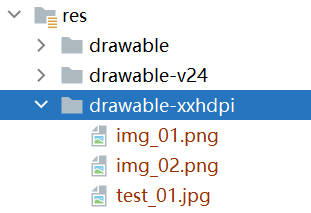

**ProgressBar**

在界面显示一个进度条，表示程序正在加载一些程序，此处为显示加载的圆圈。

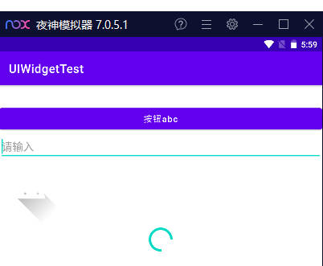

相当于一个动画，不进一步设置的话会一直旋转。因此需要将其与数据加载完成联系起来，使得其能在数据加载完成时消失。需用到 Activity 的属性(都有)默认为： `android:visibility =  visible`（可见的）；invisible(不可见的)，但仍然占据原来的位置和大小，即可看作透明状；gone 不可见且不占用任何屏幕空间。

```xml
<ProgressBar
        android:layout_width="match_parent"
        android:layout_height="wrap_content"
        android:id="@+id/progressBar"
        style="?android:attr/progressBarStyleHorizontal"
        android:max="100"
        />
```

控件的可见性使用的是 setVisibility() 方法，允许传入 View.VISIBLE、View.INVISIBLE、View.GONE 这 3 种值。也可通过 style 属性将其指定为水平进度条，再通过 `android:max="100"` 给进度条设置一个最大值。

```kotlin
 override fun onClick(v: View?) {
        when (v?.id){
            R.id.button -> {
                val inputText = binding.editText.text.toString()
                Toast.makeText(this,inputText,Toast.LENGTH_SHORT).show()
                binding.imageView.setImageResource(R.drawable.ic_launcher_background)
                //设置动作响应，每次点击按钮会将进度加10
                binding.progressBar.progress = binding.progressBar.progress + 10
            }
        }
    }
```

**AlertDialog**

弹出对话框，置于所有界面元素上，能够屏蔽其他控件的交互能力，一般用于提示一些重要的内容或信息。

注意：直接再 MainActivity.kt 种编写，无需更改 AndroidManifest.xml 文件。

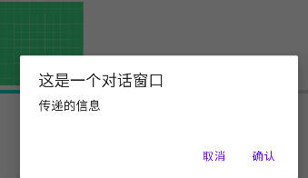

```kotlin
//MainActivity
AlertDialog.Builder(this).apply {
                    setTitle("这是一个对话窗口")
                    setMessage("传递的信息")
                    setCancelable(false)
                    setPositiveButton("确认"){
                        dialog,which ->
                    }
                    setNegativeButton("取消"){
                        dialog,which ->
                    }
                    show()
                }
```

首先通过 AlertDialog.Builder 构建一个对话框，并使用 Kotlin 的标准 apply 函数。并在 apply 函数中设计这个对话框：标题、内容、是否使用 Back 键关闭对话框等，接下来调用 setPositiveButton() 方法为对话框设置确定按钮的点击事件以及取消按钮事件，最后调用 show() 方法将对话框显示出来。

### 4.3 3 种基本布局

布局是一种放置很多控件的容器，可以按照一定的规律调整内部控件的位置，同时布局也可以嵌套布局，从而形成丰富友好的界面。

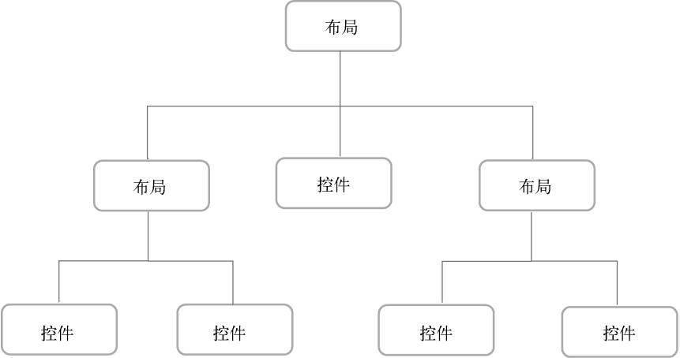

**1.LinearLayout**

线性布局会将其包含的控件在线性方向上依次排列，用 `android:orientation` 指定排列的方向 ，`verticcal|horizontal` 分别为垂直和水平方向排列。

注意排列方向为 horizontal 时，内部的控件绝对不能将宽度指定为 match_parent，同理 vertical 高度不能指定为 match_parent。

- `android:gravity`：指定文字在控件中的对齐方式
- `android:layout_gravity`：指定控件在布局中的对齐方式
- `android:layout_weight`：使用比例方式指定控件大小

注意的是，排列方向为 horizontal(水平) 时，只有垂直方向的对齐方式才会生效；同理 vertical 也类似。

实例：编写发送消息的界面

此处将 EditText 和 Button 的宽度都指定为 0 dp，此时控件宽度由 layout_width 决定，设置的两者值均是 1 ，表示二者在水平方向平分宽度。原理解释：系统会将所有控件指定的 layout_weight 值相加，得到一个总值，然然后每个控件所占的比例就是用该控件的 layout_weight 值除以总值得到。

```xml
<EditText
        android:id="@+id/send_message"
        android:layout_width="0dp"
        android:layout_height="wrap_content"
        android:layout_weight="1"
        android:hint="请输入发送的信息"
        />
    <Button
        android:id="@+id/button"
        android:layout_width="0dp"
        android:layout_height="wrap_content"
        android:text="发送"
        android:layout_weight="1"
        android:textAllCaps="false"
        />
```

更舒服的设计是，将 Button 的宽度改回 wrap_content，而 EditText 的 layout_weight 属性不变，仍为 1。这样可以在 Button 合适的前提下，让 EditText 占满水平方向剩余的屏幕。

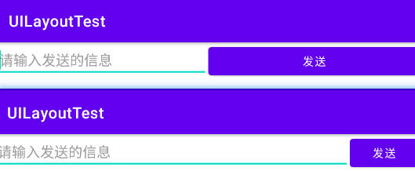

**2.RelativeLayout**

相对布局更加随意，通过相对定位的方式让构件出现在布局的任何位置。**RelativeLayout 属性很多，但有规律可循**。

每个控件相对于父布局进行定位：

```xml
android:layout_alignParentLeft="true"
android:layout_alignParentTop="true"
```

相对控件进行定位：

```xml
<!--按钮1相对于按钮3在左上-->
android:layout_above="@+id/button3"
android:layout_toLeftOf="@+id/button3"
```


边缘对齐

- `android:layout_alignRight="@+id/button3"`：边缘右对齐
- `android:layout_alignBottom="@+id/button3"`：边缘底部对齐


**FrameLayout**

帧布局，应用场景少，布局简单。所有控件默认摆放在布局左上角，根据定义的前后顺序，构件会重叠。

### 4.4 自定义控件

所有控件直接或间接继承自 View，所有的布局直接或间接继承自 ViewGroup。View 为基本的 UI 组件，在屏幕上可以绘制一个矩形区域并响应该区域中的各种事件。其他控件都是在 View 的基础上添加了新功能。

ViewGroup 是一种特殊的 View，可以包含多个子 View 和子 ViewGroup，相当于一个放置控件和布局的容器。

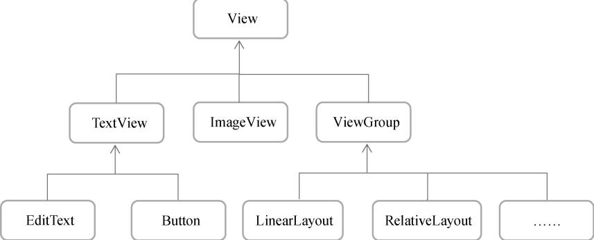

**引入布局**

多个 Activity 都需要，为避免代码的大量重复，可通过引入布局的方式解决问题。

- `android:layout_margin:"5dp"`，指定控件在上下左右方向的间距
- `android:layout_marginLeft:"5dp"`，单独指定在某个方向的间距

首先确保原有的标题布局隐藏，而后在 layout 下新建一个 title.xml 布局，即设计的标题栏布局。而后可在 activity_main.xml 中通过 `<include layout="@layout/title"/>` 进行调用。

```kotlin
class MainActivity : AppCompatActivity() {
    override fun onCreate(savedInstanceState: Bundle?) {
        super.onCreate(savedInstanceState)
        setContentView(R.layout.activity_main)
//        隐藏掉自带的标题栏
        supportActionBar?.hide()
    }
}
```

**创建自定义控件**

自定义控件解决多次重复的注册事件。在 TitleLayout 的主构造函数中声明 Context 和 AttributeSet 参数，布局中引入 TitleLayout 控件时就会调用这个构造函数，而后在 init 结构体中借助 LayoutInflater 的 from() 方法得到一个 LayoutInflater 对象，再用 inflate() 该方法动态加载布局文件，接收两个参数：1.布局文件的 id；2.给加载好的布局再添加父布局，此处使用的为 TitleLayout ，故直接传入 this。

```kotlin
//TitleLayout.kt
class TitleLayout (context: Context,attrs:AttributeSet):LinearLayout(context,attrs) {
    init {
        LayoutInflater.from(context).inflate(R.layout.title,this)
    }
}
```

添加自定义控件时需指明控件的完整类名，包名也不省略，如下为在 activity_main.xml 写入的代码：

```xml
<com.example.uicustomviews.TitleLayout
        android:layout_width="match_parent"
        android:layout_height="wrap_content"
        />
```

**重点：在自定义控件中使用 ViewBinding 功能**

```kotlin
class TitleLayout(context : Context, attrs : AttributeSet) : LinearLayout(context, attrs) {
    private var binding : TitleBinding
    init {
        //重要的一行代码
        binding = TitleBinding.inflate(LayoutInflater.from(context), this, true)
//context参数实际上是一个 Activity 实例，在返回按钮的点击事件里，使用关键字 as 先转换为 Activity 类型再销毁
        binding.titleBack.setOnClickListener {
            val activity = context as Activity
            activity.finish()
        }
        binding.titleEdit.setOnClickListener {
            Toast.makeText(context, "Edit", Toast.LENGTH_SHORT).show()
        }
    }
}
```

### 4.5 经典控件：ListView

最常用的控件之一，用于展示大量数据。通过手指上下滑动的方式将屏幕外的数据滚动到屏幕内，如查看消息记录。

- 集合中的数据借助适配器将数据传递给 ListView 控件，android 有很多适配器的实现类，推荐的是 ArrayAdapter，可以通过泛型来指定合适的数据类型，然后在构造函数中把适配的数据传入。ArrayAdapter 有多个构造函数，依次传入（Activity 实例，ListView 子项布局的选项，数据源）。

- 调用 ListView 的 setAdapter() 方法，将构建好的适配器对象传递进去，从而建立 ListView 和 数据间的关联。

注意的是：`android.R.layout.simple_list_item_1` 作为 ListView 子项布局的 id，是一个 Android 内置的布局文件，里面只有一个 TextView。

```kotlin
//MainActivity
private val data = listOf("苹果","柿子","梨","桃子","西瓜","橙子","草莓","杨梅","蓝莓","葡萄","樱桃")

    override fun onCreate(savedInstanceState: Bundle?) {
        super.onCreate(savedInstanceState)
        val binding = ActivityMainBinding.inflate(layoutInflater)
        setContentView(binding.root)
        val adapter = ArrayAdapter<String>(this,android.R.layout.simple_list_item_1,data)
        binding.listView.adapter = adapter
    }
```

**定制 Listview 界面**

为文字配置图片，丰富界面表现

1.定义一个实体类：作为 ListView 适配器的适配类型，建立 Fruit 类。

2.为 ListView 子项指定一个自定义的布局：在 layout 文件夹下新建 fruit_item.xml。

3.创建一个自定义的适配器：新建 FruitAdapter 类，继承自 ArrayAdapter，泛型指定为 Fruit 类。

```kotlin
//自定义适配器，创建FruitAdapter类
class FruitAdapter(activity: Activity, val resourceId: Int, data: List<Fruit> ):ArrayAdapter<Fruit>(activity, resourceId, data){
    override fun getView(position: Int, convertView: View?, parent: ViewGroup): View {
//      加载传入传入的布局
        val view = LayoutInflater.from(context).inflate(resourceId, parent, false)
        val fruitImage: ImageView = view.findViewById(R.id.fruitImage)
        val fruitName: TextView = view.findViewById(R.id.fruitName)
//        获取当前 Fruit 实例
        val fruit = getItem(position)
        if (fruit != null){
            fruitImage.setImageResource(fruit.imageId)
            fruitName.text = fruit.name
        }
        return view
    }
}
```

4.最后修改 MainActivity 中的代码。

```kotlin
//MainActivity
private val fruitList = ArrayList<Fruit>()
    override fun onCreate(savedInstanceState: Bundle?) {
        super.onCreate(savedInstanceState)
        val binding = ActivityMainBinding.inflate(layoutInflater)
        setContentView(binding.root)
//        初始化数据,Fruit类列表
        initFruits()
//		  创建适配器        
        val adapter = FruitAdapter(this, R.layout.friut_item, fruitList)
        binding.listView.adapter = adapter
    }
```

**优化 ListView **

ListView 控件难用因为其很多细节可以优化，运行效率就是其中的一点。上面的方法中 ListView 的运行效率会很低，因为 getView() 方法每次都会将布局加载一遍，当快速滚动时，效率不足。

getView() 方法还有一个 convertView 参数，用于将之前加载好的布局进行缓存，便于日后重用。从而借此可修改 FruitAdapter 类。

- 不重复加载布局：用 getView() 方法进行判断，如果为 convertView == null，则用 layoutInflater 加载布局；如果 convertView != null，则对 convertView 进行重用。
- 借助 ViewHolder 对 View 每次调用 findViewById() 获取控件进行优化。

```kotlin
//FruitAdapter类
override fun getView(position: Int, convertView: View?, parent: ViewGroup): View {
//    变量的延迟赋值
        val view: View
        val viewHolder: ViewHolder
        if (convertView == null){
            //      加载传入传入的布局
            view = LayoutInflater.from(context).inflate(resourceId, parent, false)
            val fruitImage: ImageView = view.findViewById(R.id.fruitImage)
            val fruitName: TextView = view.findViewById(R.id.fruitName)
//            缓存数据
            viewHolder = ViewHolder(fruitImage, fruitName)
            view.tag = viewHolder
        } else {
            view = convertView
            viewHolder = view.tag as ViewHolder
    }
```

kotlin 用 inner class 新增内部类 viewHolder，用于对 ImageView 和 TextView 的控件实例进行缓存。convertView 为空，创建一个 ViewHolder 对象并在实例存储其中，而后调用 View 的 setTag() 方法，将 ViewHolder() 对象存储在 View 中。

不为空，则直接调用 View 的 getTag() 方法，把 ViewHolder 重新取出。这样所有的控件实例都缓存在 ViewHolder 中，不必通过 findViewById() 获取控件了。

**ListView 点击事件**

响应用户点击事件，使用 setOnItemClickListener() 方法为 ListView 注册一个监听器，点击 ListView 中的任何一个子项时，就会调用到 Lambda 表达式。此处可通过 position 参数判断用户点击的是那个子项，而后通过 Toast 将水果的名字显示出来。

```kotlin
//MainActivity.kt
//lambda 表达式
binding.listView.setOnItemClickListener {
            parent, view, position, id ->
            val fruit = fruitList[position]
            Toast.makeText(this, fruit.name, Toast.LENGTH_SHORT).show()
        }
```

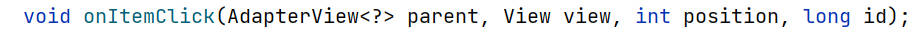

Lambda 表达式语法结构：

{参数名1：参数类型，参数名2：参数类型 -> 函数体}

Lambda 表达式声明了 4 个参数，实际用到的只有 position 参数，此时更推荐使用下划线来替代，但位置绝对不能改变。

 ```kotlin
 //下划线代替
 binding.listView.setOnItemClickListener {
             _, _, position, _ ->
             val fruit = fruitList[position]
             Toast.makeText(this, fruit.name, Toast.LENGTH_SHORT).show()
         }
 ```

### 4.6 滚动控件：RecyclerView

ListView 功能强大，但是运行效率是一大缺点，不使用一些技巧来提升其运行效率的话 ListView 性能会很差。同时，ListView 的扩展性不够好，只能实现数据纵向滚动的效果，横向滚动效果则做不到。

Android 提供新增的控件—RecyclerView，相当于增强版 ListView，优化 ListView 的各种不足，同时官方也更加推荐使用 RecyclerView。

**基本用法**

- RecyclerView 属于新增控件，为确保其在所有的 Android 系统版本上都能使用，Google 将 RecyclerView 控件定义在 AndroidX 中。只需在 build.gradle 中添加对 RecyclerView 库的依赖即可。

```xml
implementation fileTree(dir: 'libs', include: ['*.jar'])
implementation 'androidx.recyclerview:recyclerview:1.2.1'
```

参照：https://developer.android.google.cn/jetpack/androidx/releases/recyclerview?hl=zh_cn 进行声明。

- 更改 `activty_main.xml` 文件，RecycleView 并不是内置在系统 SDK 中，所以需要把完整的包路径写出来。

```kotlin
<LinearLayout xmlns:android="http://schemas.android.com/apk/res/android"
    android:layout_width="match_parent"
    android:layout_height="match_parent">
    <androidx.recyclerview.widget.RecyclerView
        android:id="@+id/recyclerView"
        android:layout_width="match_parent"
        android:layout_height="match_parent" />
</LinearLayout>
```

- 创建 `Fruit` 类和 `fruit_item.xml` ，和上面一样

- 准备一个 RecyclerView 适配器，新建一个 FruitAdapter 类

  该适配器继承自 ViewHolder（在 FruitAdapter 中定义的一个内部类），并指定泛型为 FruitAdapter.ViewHolder。

```kotlin
class FruitAdapter(val fruitList: List<Fruit>) : RecyclerView.Adapter<FruitAdapter.ViewHolder>() {
    inner class ViewHolder(view: View) : RecyclerView.ViewHolder(view) {
        val fruitImage: ImageView = view.findViewById(R.id.fruitImage)
        val fruitName: TextView = view.findViewById(R.id.fruitName)
    }
    override fun onCreateViewHolder(parent: ViewGroup, viewType: Int): ViewHolder {
        val view = LayoutInflater.from(parent.context).inflate(R.layout.fruit_item, parent, false)
        return ViewHolder(view)
    }
    override fun onBindViewHolder(holder:ViewHolder, position: Int) {
        val fruit = fruitList[position]
        holder.fruitImage.setImageResource(fruit.imageId)
        holder.fruitName.text = fruit.name
    }
    override fun getItemCount() = fruitList.size
}
```

1. 首先定义一个内部类 ViewHolder 继承自 RecyclerView.ViewHolder ,ViewHolder 的主构造函数要传入一个 View 参数，FruitAdapter 也有一个主构造函数，主要用传入数据源。
2. 重写三个方法，onCreateViewHolder() 方法用于**创建 ViewHolder 实例**，将加载出的布局传入构造函数中，并将 ViewHolder 的实例返回。
3. onBindViewHolder() 方法用于**对 RecyclerView 子项数据进行赋值**，当子项出现在当前的屏幕中时，可通过 position 参数得到当前的实例 Fruit。然后将数据设置到 ViewHolder 的 ImageView 和 TextView 选择中去。
4. getItemCount() 用于告诉 RecyclerView 一**共有多少个子项**，返回数据源的长度。

**横向滚动**

- 对 **fruit_item.xml 文件**布局排列方向进行更改，并设置固定宽度 80dp，采用 warp_content 则不美观，文字长度不一致。采用 match_parent 会导致宽度一个子项就占满整个屏幕。

```xml
<LinearLayout
android:layout_width="80dp"
android:layout_height="wrap_content"
android:orientation="vertical">   
    <ImageView
        ...
        android:layout_gravity="center_horizontal"
        android:layout_marginTop="10dp"
        />
</LinearLayout>
```

设置 ImageView 和 TextView 水平居中：`center_horizontal`，并设置 `layout_marginTop="10dp"` ，使得文字图片保持一定的距离。

- **修改 MainActivity 文件**

只需添加一行代码，调用 LinearLayoutManager 的 setOrientation() 方法设置排列方向。

```kotlin
val layoutManager = LinearLayoutManager(this)
//横向滚动添加的一行代码
layoutManager.orientation = LinearLayoutManager.HORIZONTAL
 // 设置到 RecyclerView 中，即指定 RecyclerView 布局方式
binding.recyclerView.layoutManager = layoutManager
```

**其他布局**

ListView 的布局排列由自身管理，而 RecyclerView 则交由 LayoutManager 实现。LayoutManager 制定了一套可扩展的布局排列接口，子类按照接口规范实现即可定制不同排列方式的布局。

除了前面的 LinearLayoutManager 之外，RecyclerView 也提供了 **GridLayoutManager (实现网格布局)和 StaggeredGridLayoutManager（瀑布流布局）**。

**瀑布流布局的实现**

瀑布流宽度根据布局的列数自动适配，故设置 `android:layout_width="match_parent"`。

`android:layout_margin="5dp"` 让子项间互留一点间距

```xml
<LinearLayout
android:layout_width="match_parent"
android:layout_margin="5dp"
android:layout_height="wrap_content"
android:orientation="vertical">   
    <ImageView
        ...
        android:layout_gravity="center_horizontal"
        android:layout_marginTop="10dp"
        />
</LinearLayout>
```

同样 MainActivity 只需修改一行代码，在 onCreate() 方法中创建一个 StaggeredGridLayoutManager 实例，其构造函数接收两个参数：1.指定布局的列数；2.指定布局的排列方向。

```kotlin
//MainActivity
val layoutManager = StaggeredGridLayoutManager(3, StaggeredGridLayoutManager.VERTICAL)
```

瀑布模型，个别扩大，无空白间隔，更适合多文字的效果。

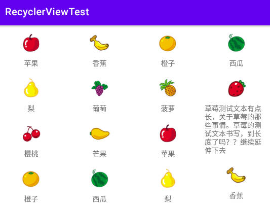

**GridLayoutManager (实现网格布局)** 实现的效果，整行同时扩大，具有整体性。

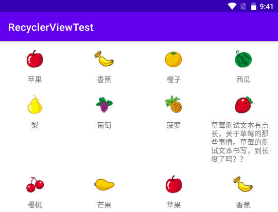

**RecyclerView 点击事件**

需要根据子项具体的 View 去注册点击事件，实现子项的某个按钮的针对性处理。

```kotlin
override fun onCreateViewHolder(parent: ViewGroup, viewType: Int): ViewHolder {
//        创建ViewHolder实例
        val view = LayoutInflater.from(parent.context).inflate(R.layout.fruit_item, parent, false)
        val viewHolder = ViewHolder(view)
        viewHolder.itemView.setOnClickListener {
            val position = viewHolder.bindingAdapterPosition
            val fruit = fruitList[position]
            Toast.makeText(parent.context, "点击了外层布局${fruit.name}",Toast.LENGTH_SHORT).show()
        }
        viewHolder.fruitImage.setOnClickListener {
            val position = viewHolder.bindingAdapterPosition
            val fruit = fruitList[position]
            Toast.makeText(parent.context, "点击了图片${fruit.name}",Toast.LENGTH_SHORT).show()
        }
        return viewHolder
    }
```

在 onCreateViewHolder() 中注册点击事件，itemView 表示最外层布局，RecyclerView 可以实现子项中任意控件或布局的点击事件。在两个点击事件中先获取用户点击的 position，然后通过 position 拿到相应的 Fruit 实例。

### 4.7 UI实践-聊天界面编写

**9-Patch 图片格式的操作**

参考：https://www.runoob.com/w3cnote/android-tutorial-9-image.html

被处理过的 png 图片，可以指定那些区域被拉伸，那些不可以， 从而在图片拉伸的时候特定的区域不会发生图片失真。(可直接在 AS 中编辑保存)

1.操作 Google 自带的工具：`D:\android-sdk\tools`，即在安装的 `sdk` 目录的 `tools` 工具下。

口诀：左上拉伸，右下内容。

- 左上两条边用于设置拉伸的纵向（L）和横向区域（T）
- 右下两条边用于设置前景的纵向（R）:前景能显示的纵向范围。即前景的最上面可以显示到什么地方，最下面可以显示的什么地方；横向（B）表示前景能显示的横向范围。即前景的最左边可以显示到什么地方，最右边可以显示的什么地方。

该图片用于设置指定范围内拉伸，其中圆角不在拉伸范围内，即圆角保持不变。鼠标点击生成黑线，按住 `shift` 键点击鼠标则消除黑线。

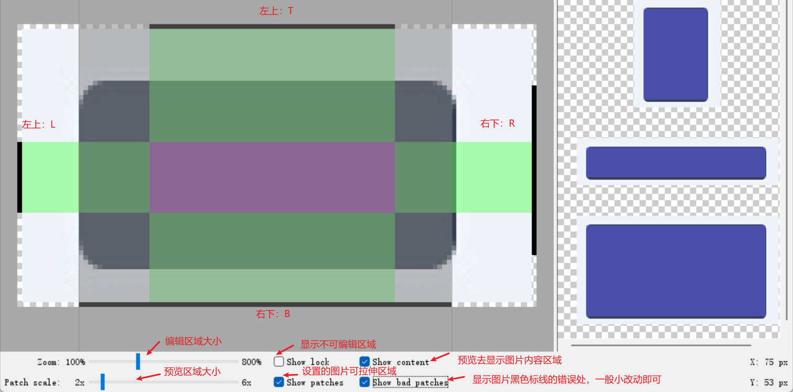

**activity_main.xml**

其中放置了一个 RecyclerView 用于显示聊天的消息内容。

EditText 用于输入消息；Button 用于发送消息。

**消息类 Msg.kt**

content 表示消息内容，type 表示消息类型。有两个值可以选择：TYPE_RECEIVED（收到的消息）；TYPE_SEND（发出的消息）。需要注意的是，定义常量的关键字 const 只有在单例类、companion object 或顶层方法中才可以使用。

```kotlin
class Msg(val content: String, val type: Int) {
    companion object {
        const val TYPE_RECEIVED = 0
        const val TYPE_SENT = 1
    }
}
```

**RecyclerView 的子项布局：msg_left_item.xml、msg_right_item.xml**

msg_left_item.xml：接收消息的子布局，受到的消息左对齐，使用设置好的图片为背景图。

msg_right_item.xml：发出消息的子布局，发送的消息右对齐。

**RecyclerView 的适配器：MsgAdapter 类**

### 4.8 kotlin 使用技巧2

**延迟初始化**

```kotlin
private lateinit var adapter: MsgAdapter
```

避免使用全局变量时候，赋值为 null 的情况。当然，必须保证后续在任何地方对其初始化，如果直接使用的话，程序会崩溃，抛出异常 `UninitializedPropertyAccessException` 异常。

当然也可以通过一些方法判断是否完成了初始化（固定写法）,如果没有完成初始化，则立即对 adapter 变量进行初始化，否则什么也不用作。

```kotlin
if (!::adapter.isInitialized) {
    adapter = MsgAdapter(msgList)
}
```

**密封类**

定义 Result 接口，用于表示某个操作的执行结果，接口不编写任何内容，然后定义两个类去实现 Result 接口。

```kotlin
interface Result
class Success(val msg: String):Result
class Faiure(val error:Exption):Result
```

getResultMsg() 方法接收一个 Result 参数，通过 when 语句判断，Result 是 Success 类，则返回成功消息，类似的 Failure 亦然。

但是为了 kotlin 编译器的顺利进行，又不得不编写 else 条件，否则编译器不通过。而且如果新定义了一个类，忘记添加到分支中去，最终会走到 else 分支抛出异常，导致程序崩溃。**这就是一大问题：为满足编译器的要求而编写的无用条件分支。**

```kotlin
fun getResultMsg(result:Result) = when(result){
    is Success -> result.msg
    is Failure -> result.error.message
    else -> throw IllegalArgumentException
}
```

**解决方法**

kotlin 的密封类，关键字：sealed class

```kotlin
sealed class Result
//密封类是可继承的类，继承的时候需要在后面加上括号
class Success(val msg: String):Result()
class Failure(val error:Exception):Result()
```

使用密封类，可以去掉 else 条件正常编译。**密封类保证所有条件的全部处理，不会漏写分支。**

原理：when 语句传入一个密封类变量作为条件时，kotlin 编译器会自动检查该密封类有那些子类，并强制要求将每个子类所对应的条件全部处理，从而保证即使没有编写 else 条件，也不会出现漏写条件分支的情况。

```kotlin
fun getResult(result:Result) = when(result) {
    is Success -> result.msg
    is Failure -> "错误原因为：${result.error.message}"
}
```

要注意的是：密封类及其子类只能定义在同一个文件的顶层位置，不能嵌套到其他类中。

## 第 5 章 兼顾平板：Fragment

一般手机的大小：3 英寸~6 英寸；平板大小：7 英寸~10 英寸。

为兼顾平板上的显示效果，Android 从 3.0 版本引入 Fragment 概念。最终在 Android 4.0 推出同时兼容手机平板的系统。

### 5.1 Fragment 简介

一种可以嵌入在 Activity 当中的 UI 片段，让程序更加合理充分利用大屏幕的空间。与 Activity 类似，包含布局、有生命周期，相当于一个迷你型 Activity。

如手机上的新闻 Activity 跳转方案：

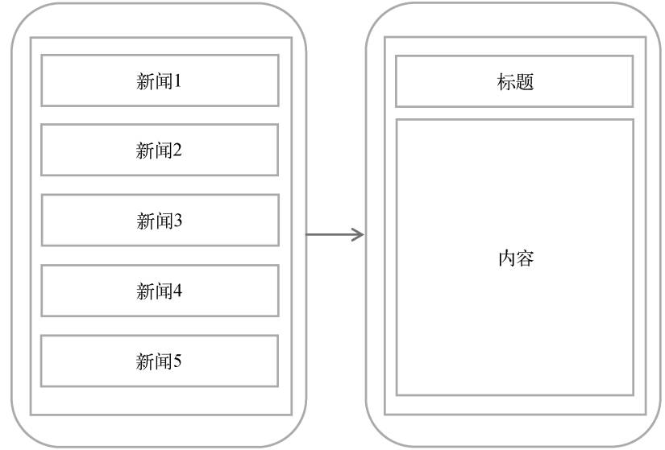

而平板上充分利用屏幕使用 Fragment 双页模式更优：

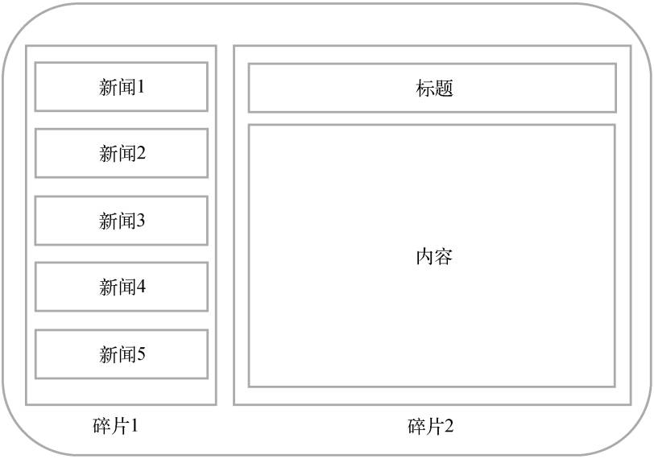

### 5.2 Fragment 使用方式

系统内置的 android.app.Fragment；AndroidX 库中的 androidx.fragment.app.Fragment。使用 AndroidX 库中的 Fragment，可以让 Fragment 的特性在所有的 Android 系统版本中保持一致，而系统内置的 Fragment 在 Android 9.0 版本已经废弃。

在 activity_main.xml 中指定添加 Fragment:

```xml
<fragment
        android:layout_width="0dp"
        android:layout_height="match_parent"
        android:id="@+id/leftFrag"
        android:name="com.example.fragmenttest.LeftFragment"
        android:layout_weight="1"/>
<fragment
        android:layout_width="0dp"
        android:layout_height="match_parent"
        android:id="@+id/rightFrag"
        android:layout_weight="1"
        android:name="com.example.fragmenttest.RightFragment"/>
```

**动态添加 Fragment**

可以在程序运行时动态添加到 Activity 中，将 activity_main.xml 中的 Fragment 替换为 FrameLayout。而 FrameLayout 布局所有的控件默认放在布局的左上角。

给左侧 Fragment 按钮注册点击事件，调用 replaceFragment() 自定义方法添加 RightFragment，从而将右侧的 RightFragment 替换为 AnotherRightFragment。

```kotlin
//MainActivity
override fun onCreate(savedInstanceState: Bundle?) {
        super.onCreate(savedInstanceState)
        val binding = ActivityMainBinding.inflate(layoutInflater)
        setContentView(binding.root)
        val button:Button = findViewById(R.id.button)
        button.setOnClickListener {
            replaceFragment(AnotherRightFragment())
        }
     	replaceFragment(RightFragment())

private fun replaceFragment(fragment: Fragment) {
        val fragmentManager = supportFragmentManager
        val transaction = fragmentManager.beginTransaction()
        transaction.replace(R.id.rightLayout, fragment)
        transaction.commit()
    }
```

动态添加需要 5 步：

1. 创建待添加的 Fragment 实例
2. 获取 FragmentManager，在 Activity 中直接调用 getSupportFragmentManager() 方法获取
3. 开启一个事务，通过调用 beginTransaction()
4. 向容器内添加或替换 Fragment，一般使用 replace() 方法实现，传入容器的 id 和待添加的 Fragment 实例
5. 提交事务，调用 commit() 方法完成

**在 Fragment 中实现返回栈**

实现按下返回键返回上一个 Fragment，使用 FragmentTransaction 中的 addToBackStack() 方法。

```kotlin
transaction.replace(R.id.rightLayout, fragment)
//返回栈
transaction.addToBackStack(null)
transaction.commit()
```

**Fragment 与 Activity 交互**

Fragment 是嵌入 Activity 中显示的，但二者各自存在于一个独立类当中。为了方便 Fragment 和 Activity 进行交互，FragmentManager 提供一个类似于 findViewById() 的方法，用于从布局文件中获取 Fragment 实例。

```kotlin
//从Activity中获取Fragment实例
val fragment = supportFragmentManager.findFragmentById(R.id.leftFrag) as LeftFragment
//老版使用kotlin-android-extension插件改写
val fragment = leftFrag as LeftFragment
```

在 Fragment 中调用 Activity 中的方法，通过调用 getActivity() 方法获得和当前 Fragment 相关联的 Activity 实例

```kotlin
if (activity != null) {
    val mainActivity = activity as MainActivity
}
```

### 5.3 Fragment 的生命周期

- **onAttach()** 当 Fragment 和 Activity 建立关联时调用
- **onCreateView()** 为 Fragment 创建视图（加载布局）时调用
- **onActivityCreated()** 确保与 Fragment 相关联的 Activity 已经创建完毕
- **onDestoryView()** 当与 Fragment 相关联时视图被移调用
- **onDetach()** 用于将 Fragment 和 Activity 解除

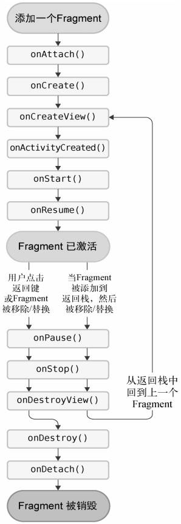

Kotlin 中定义常量的一般方式：在 companion object、单例类或顶层作用域中使用 const 关键字声明变量即可。

1.加载 RightFragment，依次调用下列方法：

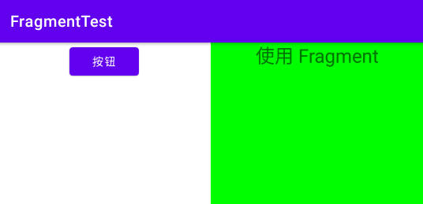

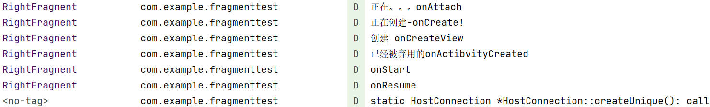

2.点击按钮，加载 AnotherRightFragment 替换当前的 RightFragment，此时 RightFragment 执行如下的方法：

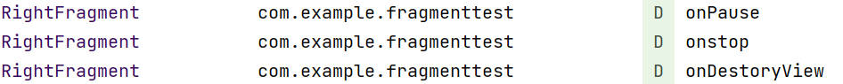

3.按返回键，返回原来的 RightFragment 可得：

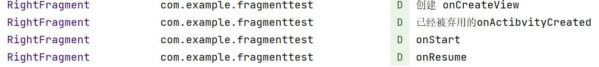

4.退出程序

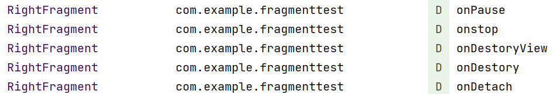

注意：Fragment 中可通过 onSaveInstanceState() 方法保存数据，而后通过 onCreate、onCreateView() 等方法中 Bundle 类型的 savedInstanceState 参数重新获得。

### 5.4 动态布局加载

**限定符(qualifier)的使用**

使用限定符判断使用的单页模式还是双页模式。创建 `layout-large` 文件夹，在该文件夹下创建 `activity_main.xml` 文件，用于双页模式，此时的 large 就是限定符，用于 large(大屏幕设备) 显示。

常见的限定符：

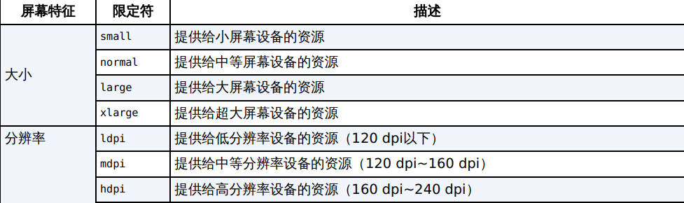

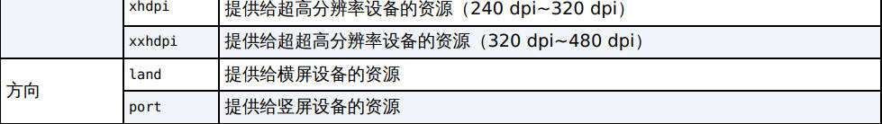


## 新方法引入

### 1.viewBuilding 的使用

要求 AS 版本在 3.6.0 以上，注意从  Android Studio Arctic Fox (2020.3.1)  以及 Android Gradle 插件 (AGP) 的 7.0.0-alpha01 版开始，Android Studio 的版本号系统将以年份为基础，从而更加符合 IntelliJ IDEA 的版本模式。(**如果沿用以前的编号系统，则此版本将为 Android Studio 4.3**)

在 app 文件夹下的 build.gradle 中的 android 结构下添加

```xml
buildFeatures {
        viewBinding true
    }
```

**1.Activity 中使用**

启动 ViewBinding 功能后，Android Studio 会自动为编写的每个**布局文件**生成一个对应的 Binding 类，自动生成的 Binding 命名是按驼峰方式重命名，最后在后面加上 Binding 作为结尾。如 `activity_main.xml` 其对应的类为 `ActivityMainBinding` 类。

有些布局文件不希望自动生成，可在根元素位置加如下声明：

```xml
<LinearLayout
tools:viewBindingIgnore:true >
</LinearLayout>
```

一般用法，在 onCreate() 内使用

- **获取视图绑定类**：使用 `ActivityMainBinding.inflate(layoutInflater)`  单纯地加载布局，即调用 activity_main.xml 布局文件对应的 Binding 类的 inflate 函数加载布局
- **关联界面**：调用 `setContentView(binding.root)` 方法将 视图绑定类 和 Activity 界面关联，，进而通过视图绑定类获得组件

```kotlin
class MainActivity : AppCompatActivity() {

    override fun onCreate(savedInstanceState: Bundle?) {
        super.onCreate(savedInstanceState)
        val binding = ActivityMainBinding.inflate(layoutInflater)
        setContentView(binding.root)
        binding.textView.text = "Hello"
    }
}
```

在 onCreate() 函数之外使用，需要将 binding 变量声明为全局变量，因为 Kotlin 声明的变量都必须在声明的同时对其进行初始化。而这里无法在声明全局 binding 变量的同时对它进行初始化，故使用 lateinit 关键字对 binding变量进行了延迟初始化。(late init ->lateinit )

```kotlin
class MainActivity : AppCompatActivity() {

    private lateinit var binding: ActivityMainBinding

    override fun onCreate(savedInstanceState: Bundle?) {
        super.onCreate(savedInstanceState)
        binding = ActivityMainBinding.inflate(layoutInflater)
        setContentView(binding.root)
        ...
    }
}
```

**2.自定义组件的视图绑定 ( ViewBinding ) **

- 明确的是自定义组件是 ViewGroup 子类，无法使用视图绑定
- **初始化视图绑定并关联界面：**`binding = TitleBinding.inflate(LayoutInflater.from(context), this, true)` 进行 视图绑定初始化 及 关联界面的操作，`this` 为 `ViewGroup` 类型，即组件本身。

```kotlin
class TitleLayout(context : Context, attrs : AttributeSet) : LinearLayout(context, attrs) {
    private var binding : TitleBinding
    init {
        binding = TitleBinding.inflate(LayoutInflater.from(context), this, true)
        binding.titleBack.setOnClickListener {
            val activity = context as Activity
            activity.finish()
        }
        binding.titleEdit.setOnClickListener {
            Toast.makeText(context, "Edit", Toast.LENGTH_SHORT).show()
        }
    }
}
```


### 2.viewBuiding 原理

参考：https://hanshuliang.blog.csdn.net/article/details/105066654

https://blog.csdn.net/wobuyaoshiye/article/details/112602587

https://blog.csdn.net/qq_45926462/article/details/128115748

**ViewBuiding 视图绑定类**

提供了两种将**视图绑定类**与**界面**的绑定方法，此处以 `layout` 文件夹下的 `activity_main.xml` 为例子。

- `ActivityMainBinding.inflate ( LayoutInflater )`：需要额外的函数将其绑定，**主要用于 Activity 界面和 Dialog 对话框。**

- `ActivityMainBinding.inflate ( LayoutInflater,  ViewGroup parent, attachToParent)`：可直接与界面进行绑定，**应用于自定义布局组件和 RecyclerView 适配器**。


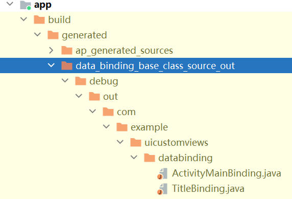

用 build 之后，可在`app/build/generated/data_binding_base_class_source_out` 下找到转换后的 Java 类，其中 `TitleBinding.java` 文件中的两个 `inflate()` 方法为：

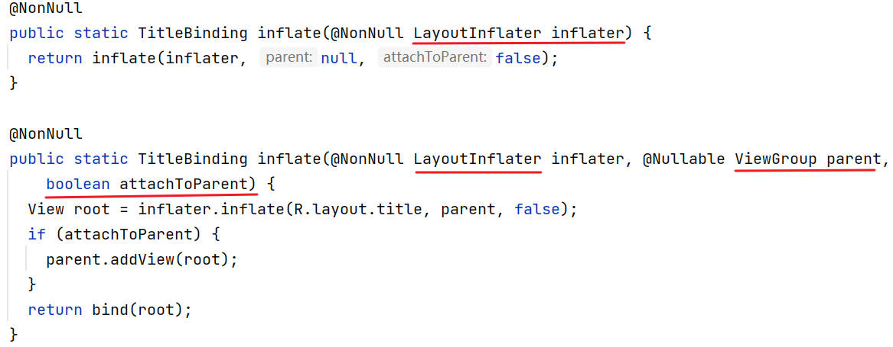

