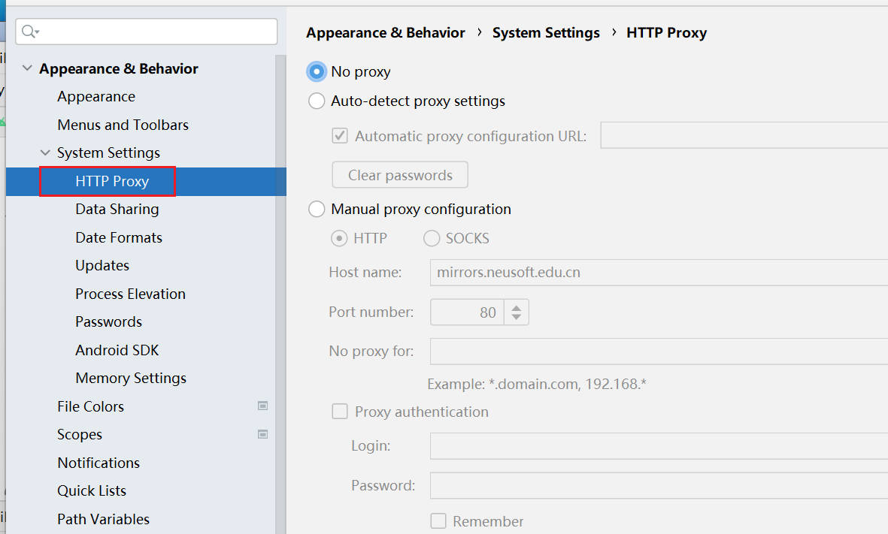
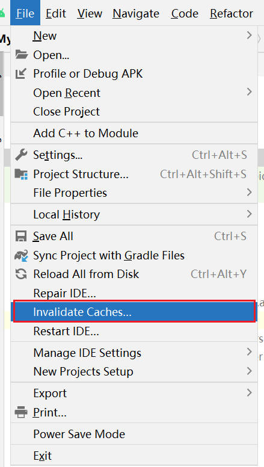
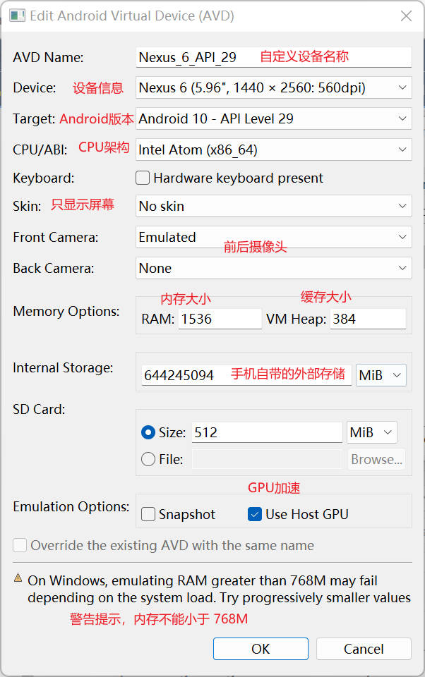
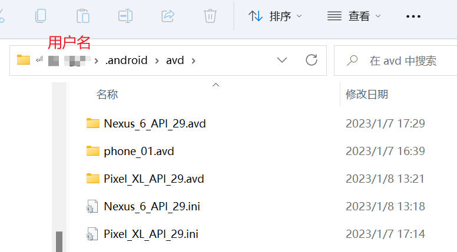
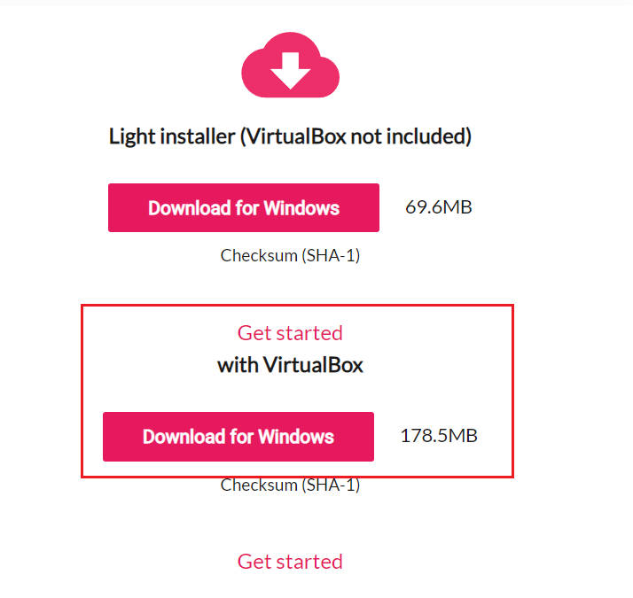
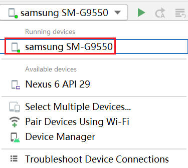
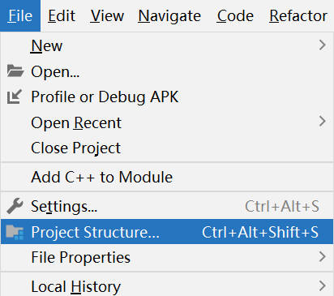
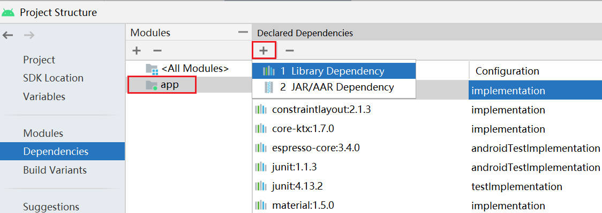
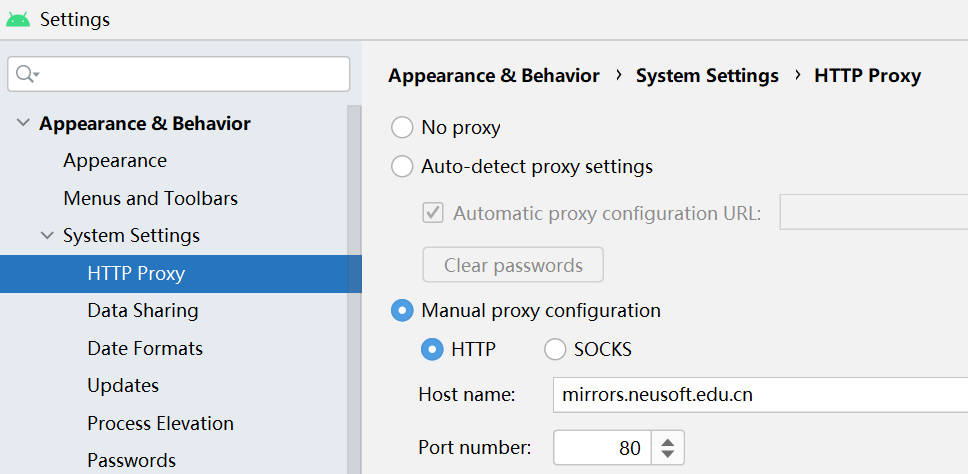

# Android_intro

## 说明

初学者推荐使用-第一行代码(第2版)，书中的 `Java` 代码十分完善。对于最新的 `kotlin` 版本，由于涉及到最新的一些机制和迭代，如 google 在 AS4.1 后宣布放弃使用 kotlin-android-extensions 插件，对新手不太友好。

## 安装

### 1.Android Studio

官网地址：https://developer.android.google.cn/studio

用户指南：https://developer.android.google.cn/studio/intro


### 2.SDK Tools

SDK 安装包网址：https://www.androiddevtools.cn/

**SDK：**(software development kit)软件开发工具包,就是安卓系统,平台架构等的工具集合,如adb.exe


参考:https://www.cnblogs.com/gj0151/p/16093834.html 进行配置和安装

详细参考！！！：https://www.cnblogs.com/kangjianwei101/p/5621238.html

**1.安装选项说明**


- Android SDK Tools（必须）：基础工具包，版本号带 rc 字样的是预览版。
- Android SDK Platform-tools（必须）：从android2.3开始划出此目录，存放公用开发工具，比如adb、sqlite3等，被划分到了这里。
- Android SDK Build-tools（必须）：Android项目构建工具。


- Android xxx（API xx） ：可选的各平台开发工具，一般选择最新版本即可。


- Android Support Repository（需要）：主要是方便在 gradle 中使用 Android Support Libraries，因为 Google 并没有把这些库发布到 maven center 或者 jcenter 去，而是使用了Google 自己的 maven 仓库。
- Intel x86 Emulator Accelerator(HAXM installer)（需要）：windows 平台的 Intel x86 模拟器加速工具，配合 Intel x86 atom/atom_64 System Image 使用可加快模拟器的运行速度。

**2.配置系统变量**

`ANDROID_HOME`：`D:\android-sdk`


配置 `path` 系统变量：

```cdm
%ANDROID_HOME%\tools
%ANDROID_HOME%\platform-tools
%ANDROID_HOME%\build-tools\29.0.3
```

配置完环境变量后，在cmd界面输入“adb” 和"aapt"来判断安装是否成功，若显示如图，则表示安装成功了。

 


### 3.安装配置的一些问题

#### 3.1 缺少加载项目

对于安装过程后出现的问题，缺少选项：https://blog.csdn.net/qq_27109535/article/details/125923105


**1.确保清空代理！！！**

确保图中的框选处为空


**2.更改 hosts 文件**

打开 hosts 文件位置 `C:\Windows\System32\drivers\etc`

在 hosts 文件中添加 `74.125.237.1 dl-ssl.google.com`，对于权限问题的解决，可现在外面复制 hosts 文件进行更改，而后替换原有的 hosts 文件即可。


**3.加载成功后重新设置代理**

1、中科院开源协会镜像站地址:

IPV4/IPV6 : http://mirrors.opencas.ac.cn 端口：80

2、北京化工大学镜像服务器地址：

IPv4: http://ubuntu.buct.edu.cn/ 端口：80

IPv4: http://ubuntu.buct.cn/ 端口：80

IPv6: http://ubuntu.buct6.edu.cn/ 端口：80

3、大连东软信息学院镜像服务器地址:(推荐)

http://mirrors.neusoft.edu.cn 端口：80

#### 3.2 无法下载的问题

无法下载的问题：将其设置为无代理，而后自动下载 gradle 和相关文件。



**初始错误的解决方案**



### 4.AVD 自带模拟器使用

**AVD：** (android virtual machine):安卓虚拟设备,就是安卓的模拟器

创建模拟器，尽量使得模拟器的分辨率不超过自己设备的分辨率



AS 内置模拟器创建后的默认目录为：`C:\Users\用户名\.android\avd`，而一个完整的模拟器大概 9G 左右，占用空间很大。



### 5.Genymotion 模拟器

Genymotion 的运行需要依赖 VirtualBox，因此安装 Genymotion 之前需要先安装 VirtualBox。

VirtualBox 下载：https://www.virtualbox.org/wiki/Downloads

或者直接下载带 VirtualBox 的 Genymotion：https://www.genymotion.com/download/（建议 VirtualBox 采用默认的 C 盘安装目录）



#### 5.1安装*.apk的问题

官网配置步骤指南：https://docs.genymotion.com/desktop/041_Deploying_an_app/

Genymotion 模拟器，以及市场上大部分以快著称的 Android 模拟器基本上都是基于 x86 架构的，x86 架构的模拟器是无法兼容 ARM 架构的 APP 的，但市场大部分 APP 都是基于 ARM 架构，也就意味着 x86 模拟器无法兼容市场上大部分模拟器，这也是快的代价。

**如何在 x86 的模拟器上安装并运行 ARM 架构的 APP**

- 在 Android SDK 管理器中直接下载 ARM 架构的 Android 镜像
- 安装一个 ARM translation 来让 Genymotion 支持 ARM 架构的 APP

ARM translation，一个ARM转换包，也被翻译成ARM翻译器，它可以让x86架构的模拟器运行ARM架构的APP。

#### 5.1 ova 辅助下载

参考文章：https://www.cnblogs.com/rainboy2010/p/6387770.html

针对虚拟设备很难下载，经常出现无法下载的情况，可以将一些虚拟设备对应的 ova下载好，而后将文件添加到

`C:\Users\用户名\AppData\Local\Genymobile\Genymotion\ova`

### 6.夜神模拟器

官网：https://www.yeshen.com/

上手快，中文友好界面且符合习惯，缺点可能是游戏广告有点多(毕竟主打的就是游戏)

安装完成后，只需在系统环境配置设置一下即可：将 `D:\Program Files\Nox\bin` 路径添加到 `path`内容下。

之后想用该模拟器，只需要先打开模拟器，会自动在 AS 中加载，默认的名称为：`samsung SM-G9550`



对于为自动添加的可切换到 `D:\Program Files\Nox\bin` 目录下，在此处打开`CMD`（win7 可按 `shift` + 鼠标右键），输入：`nox_adb.exe connect 127.0.0.1:62001` ，创建连接。


当然每次都手动输入过于麻烦，可创建一个脚本文件 `nox.bat`，输入的内容为：

```shell
D:\Program Files\Nox\bin\nox_adb.exe connect 127.0.0.1:62001
```

### 7.常见问题

#### 7.1 RecyclerView 依赖配置问题

**1.自动导入形式**

选择 `File->Project Structure`



而后选择 `Dependencies->app` ，选择添加按钮中的 `Library Dependency`.



而后搜索：`recyclerview` 选择合适的版本应用即可


**注意：如果搜索一直没有结果，可配置国内代理**

在 `File->settings` 选择设置国内代理即可，此处设置的为：

```cmd
Host name:mirrors.neusoft.edu.cn
Port number:80
```


