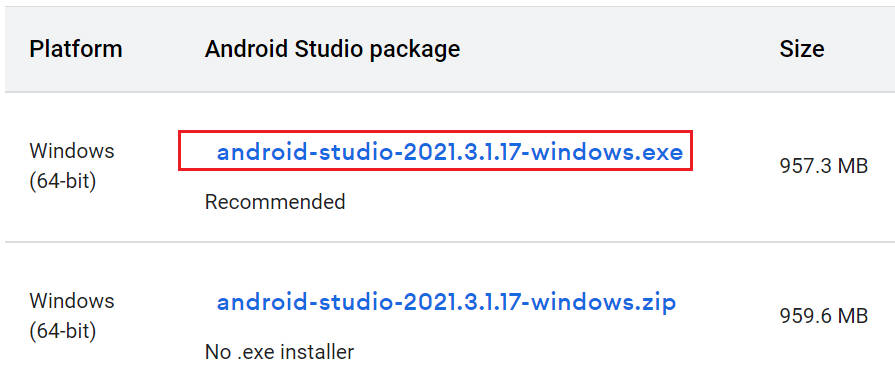
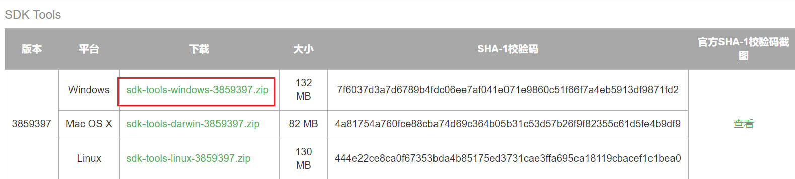
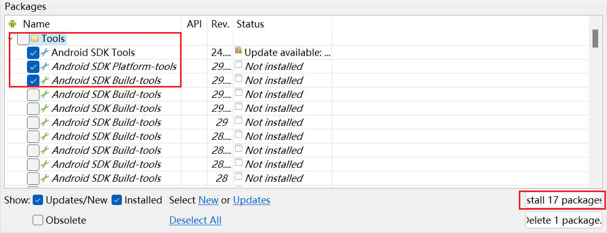
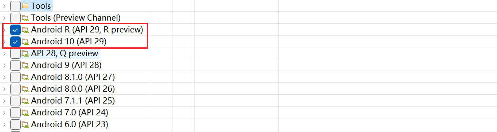
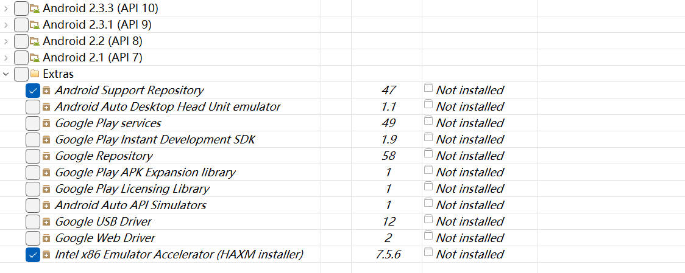
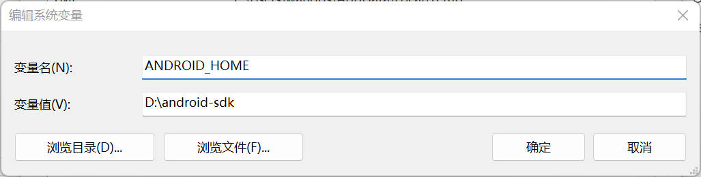
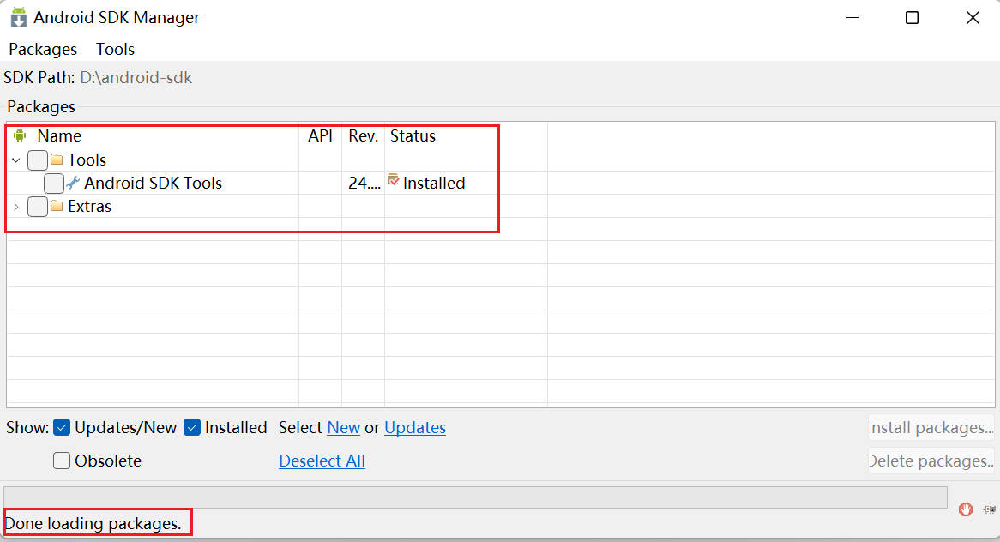
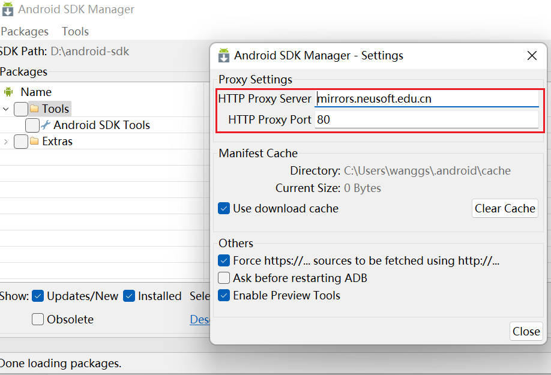
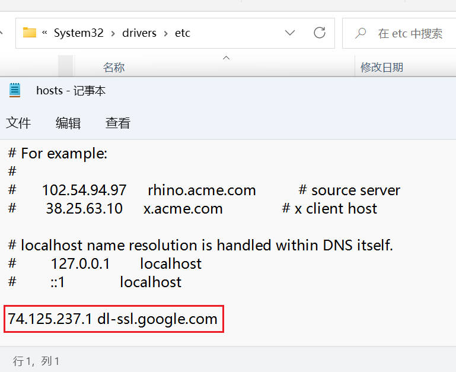

# Android_intro

## 安装

### 1.Android Studio

官网地址：https://developer.android.google.cn/studio

用户指南：https://developer.android.google.cn/studio/intro



### 2.SDK Tools

SDK 安装包网址：https://www.androiddevtools.cn/



参考:https://www.cnblogs.com/gj0151/p/16093834.html 进行配置和安装

详细参考！！！：https://www.cnblogs.com/kangjianwei101/p/5621238.html

**1.安装选项说明**




- Android SDK Tools（必须）：基础工具包，版本号带 rc 字样的是预览版。
- Android SDK Platform-tools（必须）：从android2.3开始划出此目录，存放公用开发工具，比如adb、sqlite3等，被划分到了这里。
- Android SDK Build-tools（必须）：Android项目构建工具。



- Android xxx（API xx） ：可选的各平台开发工具，一般选择最新版本即可。



- Android Support Repository（需要）：主要是方便在 gradle 中使用 Android Support Libraries，因为 Google 并没有把这些库发布到 maven center 或者 jcenter 去，而是使用了Google 自己的 maven 仓库。
- Intel x86 Emulator Accelerator(HAXM installer)（需要）：windows 平台的 Intel x86 模拟器加速工具，配合 Intel x86 atom/atom_64 System Image 使用可加快模拟器的运行速度。

**2.配置系统变量**

`ANDROID_HOME`：`D:\android-sdk`



配置 `path` 系统变量：

```cdm
%ANDROID_HOME%\tools
%ANDROID_HOME%\platform-tools
%ANDROID_HOME%\build-tools\29.0.3
```

配置完环境变量后，在cmd界面输入“adb” 和"aapt"来判断安装是否成功，若显示如图，则表示安装成功了。

 


### 3.安装配置的一些问题

#### 3.1 缺少加载项目

对于安装过程后出现的问题，缺少选项：https://blog.csdn.net/qq_27109535/article/details/125923105



**1.确保清空代理！！！**

确保图中的框选处为空



**2.更改 hosts 文件**

打开 hosts 文件位置 `C:\Windows\System32\drivers\etc`

在 hosts 文件中添加 `74.125.237.1 dl-ssl.google.com`，对于权限问题的解决，可现在外面复制 hosts 文件进行更改，而后替换原有的 hosts 文件即可。



**3.加载成功后重新设置代理**

1、中科院开源协会镜像站地址:

IPV4/IPV6 : http://mirrors.opencas.ac.cn 端口：80

2、北京化工大学镜像服务器地址：

IPv4: http://ubuntu.buct.edu.cn/ 端口：80

IPv4: http://ubuntu.buct.cn/ 端口：80

IPv6: http://ubuntu.buct6.edu.cn/ 端口：80

3、大连东软信息学院镜像服务器地址:(推荐)

http://mirrors.neusoft.edu.cn 端口：80