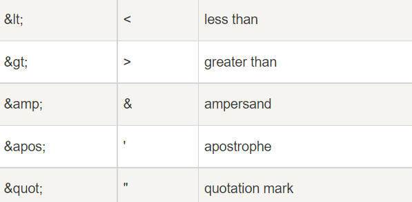

# XML_intro

## 1.简介

XML 可扩展的标记语言：e**X**tensible **M**arkup **L**anguage

用来传输和存储数据，不用于表现和展示数据，HTML 用来表现数据。

标签必须成对出现，有开始标签就需要有结束标签，XML 文档使用简单的具有自我描述性的语法。

**XML 是独立于软件和硬件的信息传输工具。**

### 1.1 用途

**XML 把数据从 HTML 分离**

解决 HTML 中动态数据问题，将数据存储在独立的 XML 文件中，而后通过几行 JavaScript 代码就可以读取外部的 XML 文件，从而更新网页的数据内容。

**XML 简化数据共享**

XML 数据以纯文本格式进行存储，因此提供了一种独立于软件和硬件的数据存储方法。

### 1.2 语法

**声明**

声明不是 XML 文档本身的一部分，没有关闭标签

```xml
<!-- 注释：This is a comment -->
<?xml version="1.0" encoding="utf-8"?>
```

**大小写敏感**

XML 标签对大小写敏感。标签 `<Letter>` 与标签 `<letter>` 是不同的。

**属性**

与 HTML 类似，XML 元素也有属性，**其 XML 的属性值必须加引号**。在 XML 中，应该尽量避免使用属性，如果信息感觉起来很像数据，那么请使用元素吧。

- 属性不能包含多个值（元素可以）
- 属性不能包含树结构（元素可以）
- 属性不容易扩展（为未来的变化）

属性值用双引号 **"** 或单引号 **'** 分隔，如果属性值中有单引号，则用双引号分隔；如果有双引号，则用单引号分隔。二者都有，则使用转义字符。

```xml
<元素名 属性名1="属性值1" 属性名2="属性值2">
```

**换行形式**

在 Windows 应用程序中，换行通常以一对字符来存储：回车符（CR）和换行符（LF），而 XML 以 LF 存储换行。

**特殊字符替代**

注意 XML 中的空格会保留。



### 1.3 XML 验证

通过 DTD 验证的XML是"合法"的 XML。DTD（文档类型定义）的作用是定义 XML 文档的合法构建模块，可被成行地声明于 XML 文档中，也可作为一个外部引用。


### 1.4 XML 查看

使用 CSS 格式化 XML 但是不常用。

```xml
<?xml version="1.0" encoding="ISO-8859-1"?>
<?xml-stylesheet type="text/css" href="cd_catalog.css"?>
<book>
    <name>XML_intro</name>
</book>
```

**XSLT 显示 XML**

通过使用 XSLT，您可以把 XML 文档转换成 HTML 格式。XSLT（eXtensible Stylesheet Language Transformations）远比 CSS 更加完善

